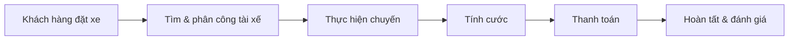
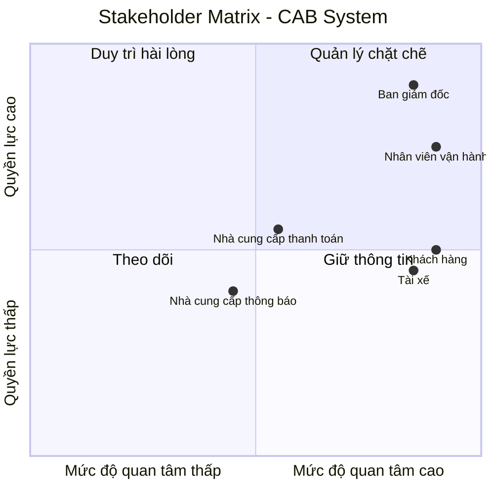
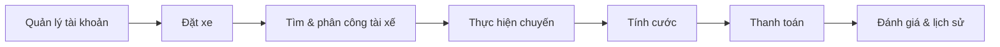
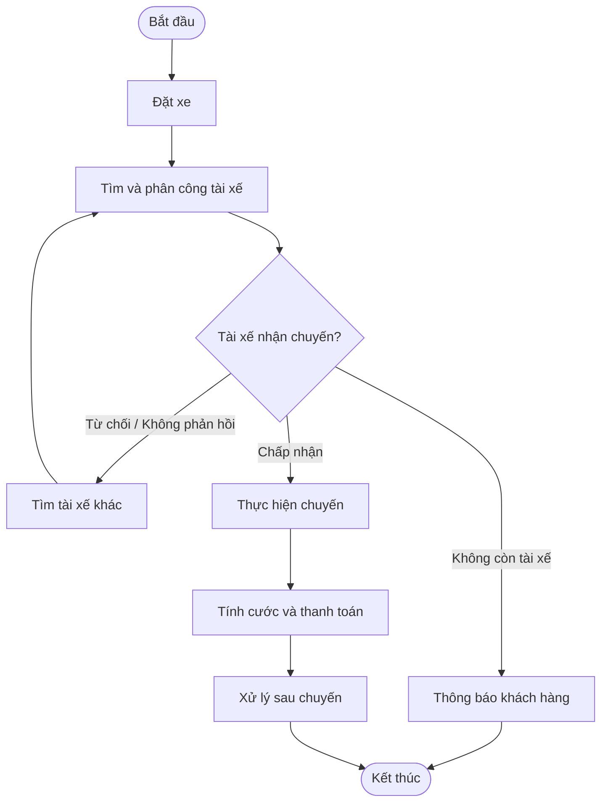
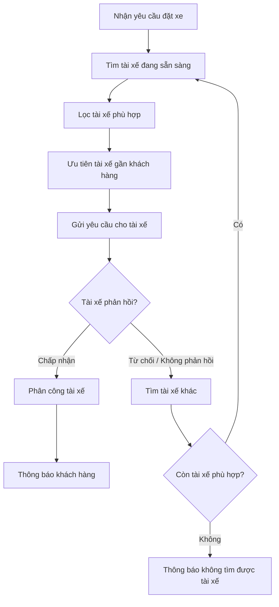
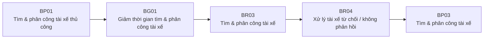
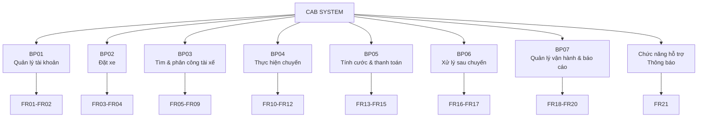
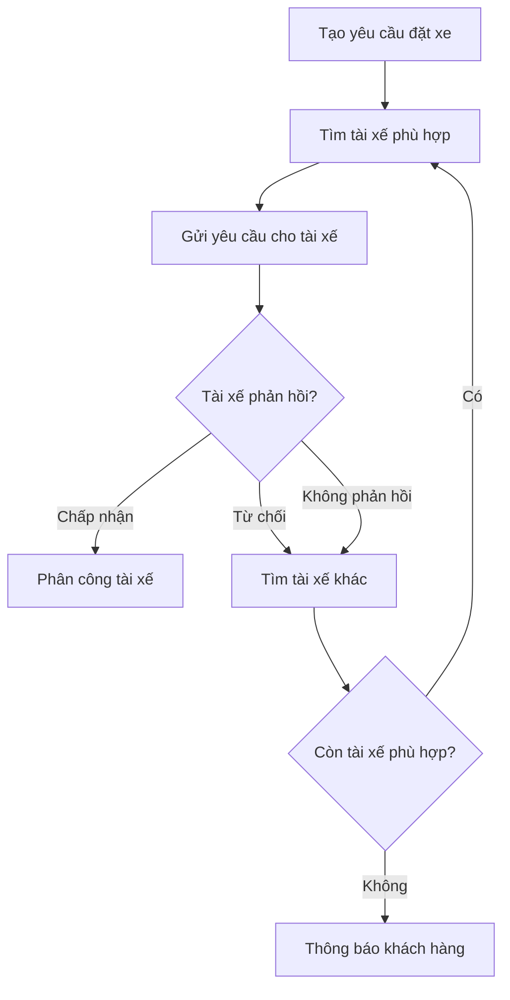
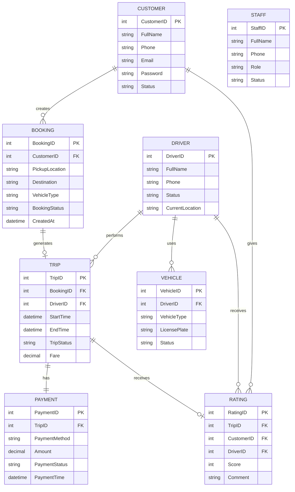
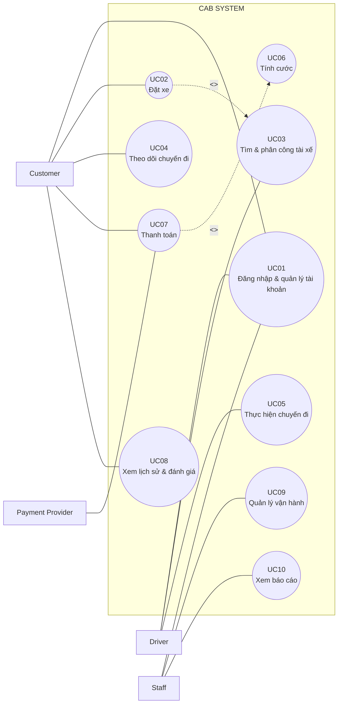

# BƯỚC 1: ĐỌC VÀ PHÂN TÍCH YÊU CẦU SƠ KHỞI

**Mục tiêu:** Hiểu bối cảnh nghiệp vụ, xác định các vấn đề hiện tại và định hướng nhu cầu của khách hàng đối với CAB System.

## 1. Bối cảnh nghiệp vụ

Công ty **ABC** cung cấp dịch vụ đặt xe CAB. Khách hàng có thể đặt xe thông qua **tổng đài hoặc ứng dụng đơn giản**. Hiện tại, một số hoạt động như tìm và phân công tài xế, theo dõi chuyến và quản lý thông tin vẫn phụ thuộc nhiều vào xử lý thủ công hoặc các công cụ riêng lẻ.

Khi số lượng khách hàng và chuyến xe tăng, cách quản lý hiện tại phát sinh nhiều hạn chế như **tốn thời gian tìm tài xế, khó theo dõi trạng thái chuyến, thông tin thanh toán chưa tập trung và khó mở rộng hoạt động**.

---

## 2. Business Problem

| Mã       | Business Problem                                     | Ảnh hưởng                                                                    |
| -------- | ---------------------------------------------------- | ---------------------------------------------------------------------------- |
| **BP01** | **Tìm và phân công tài xế còn thủ công**             | Tốn thời gian, khó xử lý khi tài xế từ chối/không phản hồi và số chuyến tăng |
| **BP02** | **Khách hàng khó theo dõi chuyến đi**                | Không thuận tiện trong việc biết tài xế, trạng thái và tiến trình chuyến     |
| **BP03** | **Thông tin thanh toán chưa được quản lý tập trung** | Khó kiểm tra, theo dõi và đối soát giao dịch                                 |
| **BP04** | **Thông tin vận hành chưa được quản lý tập trung**   | Khó quản lý khách hàng, tài xế, phương tiện và chuyến xe                     |
| **BP05** | **Khó mở rộng hệ thống**                             | Khó đáp ứng khi số lượng khách hàng, tài xế và chuyến xe tăng                |

### Business Problem chính

> **Việc tìm và phân công tài xế còn phụ thuộc nhiều vào xử lý thủ công, gây mất thời gian và khó đáp ứng khi số lượng chuyến xe tăng.**

Đây là **vấn đề trọng tâm** vì nó ảnh hưởng trực tiếp đến tốc độ xử lý yêu cầu đặt xe và khả năng mở rộng hoạt động CAB.

---

## 3. Nhu cầu chính của khách hàng

CAB System cần:

* Tự động **tìm và phân công tài xế phù hợp**.
* Cho phép khách hàng **đặt xe và theo dõi trạng thái chuyến đi**.
* Quản lý tập trung **khách hàng, tài xế, phương tiện và chuyến xe**.
* Hỗ trợ **tính cước và thanh toán**.
* Gửi **thông báo** về các sự kiện quan trọng của chuyến.
* Hỗ trợ nhân viên vận hành **theo dõi và xử lý các chuyến có vấn đề**.
* Cung cấp **báo cáo cơ bản** về hoạt động kinh doanh.
* Đảm bảo **bảo mật, phân quyền, ổn định và khả năng mở rộng**.

---

## 4. Stakeholder chính

| Stakeholder          | Vai trò chính                                 | Mối quan tâm                                                |
| -------------------- | --------------------------------------------- | ----------------------------------------------------------- |
| **Customer**         | Đặt xe, theo dõi chuyến, thanh toán, đánh giá | Đặt xe nhanh, theo dõi được tài xế và trạng thái chuyến     |
| **Driver**           | Nhận, từ chối và thực hiện chuyến             | Nhận chuyến phù hợp, cập nhật trạng thái và vị trí          |
| **Operation Staff**  | Quản lý và hỗ trợ vận hành                    | Theo dõi chuyến, tài xế và xử lý sự cố                      |
| **Management**       | Theo dõi và đánh giá hoạt động kinh doanh     | Số chuyến, doanh thu, tỷ lệ hoàn thành/hủy, hiệu quả tài xế |
| **Payment Provider** | Xử lý thanh toán điện tử                      | Giao dịch chính xác và an toàn                              |

---

## 5. Quy trình nghiệp vụ tổng quát



### Kết luận Bước 1

> **Công ty ABC cần xây dựng CAB System nhằm tự động hóa quy trình đặt xe, đặc biệt là tìm và phân công tài xế; đồng thời tập trung quản lý chuyến xe, thanh toán và vận hành, giúp cải thiện trải nghiệm khách hàng và hỗ trợ hệ thống mở rộng khi quy mô hoạt động tăng.*

Đúng theo yêu cầu **Bước 2**, nội dung bạn đưa ra khá đầy đủ. Tuy nhiên cần chỉnh một điểm quan trọng: **BA và Development Team không nên đưa vào Stakeholder Matrix nếu ma trận đang dùng để thể hiện các bên liên quan đến nghiệp vụ/hệ thống CAB**. Hai nhóm này là đội **thực hiện dự án**, không phải stakeholder nghiệp vụ chính.

Ngoài ra, **Nhà cung cấp thanh toán** và **Nhà cung cấp thông báo** vẫn là stakeholder bên ngoài hệ thống, nên có thể giữ trong danh sách.

Mình đề xuất bản hoàn chỉnh như sau:

# BƯỚC 2: XÁC ĐỊNH STAKEHOLDER

**Mục tiêu:** Xác định các bên liên quan đến CAB System, vai trò, mối quan tâm và mức độ ảnh hưởng của từng stakeholder đối với hệ thống.

## 1. Danh sách Stakeholder

| **Stakeholder**                     | **Vai trò / Mối quan tâm đối với hệ thống**                                                                                                                         |
| ----------------------------------- | ------------------------------------------------------------------------------------------------------------------------------------------------------------------- |
| **Ban giám đốc**                    | Đưa ra định hướng và mục tiêu của dự án; theo dõi số chuyến, doanh thu, tỷ lệ hoàn thành, tỷ lệ hủy và hiệu quả tài xế; quan tâm đến khả năng mở rộng của hệ thống. |
| **Khách hàng**                      | Đăng ký/đăng nhập, nhập điểm đón – điểm đến, chọn loại xe, đặt xe, theo dõi chuyến, xem lịch sử, thanh toán và đánh giá tài xế.                                     |
| **Tài xế**                          | Quản lý hồ sơ và phương tiện, cập nhật trạng thái sẵn sàng, nhận/từ chối chuyến và cập nhật trạng thái trong quá trình thực hiện chuyến.                            |
| **Nhân viên vận hành**              | Quản lý khách hàng, tài xế, phương tiện và chuyến xe; theo dõi chuyến đang diễn ra, trạng thái tài xế và hỗ trợ xử lý các chuyến có vấn đề.                         |
| **Nhà cung cấp dịch vụ thanh toán** | Cung cấp dịch vụ thanh toán điện tử, xử lý giao dịch và trả kết quả thanh toán cho CAB System; CAB không lưu trực tiếp thông tin thanh toán nhạy cảm.               |
| **Nhà cung cấp dịch vụ thông báo**  | Hỗ trợ gửi thông báo đến khách hàng và tài xế về các sự kiện quan trọng như xác nhận đặt xe, tài xế nhận chuyến, tài xế đến và kết quả chuyến.                      |

### Stakeholder hỗ trợ dự án

| **Stakeholder**           | **Vai trò**                                                                                                                             |
| ------------------------- | --------------------------------------------------------------------------------------------------------------------------------------- |
| **Business Analyst (BA)** | Phân tích, làm rõ và quản lý yêu cầu nghiệp vụ; xác định phạm vi, quy trình, yêu cầu chức năng, phi chức năng và các quy tắc nghiệp vụ. |
| **Development Team**      | Phân tích kỹ thuật, xây dựng, kiểm thử, triển khai và bảo trì CAB System theo yêu cầu đã được xác định.                                 |

> **Lưu ý:** BA và Development Team vẫn có thể được liệt kê để thể hiện **đầy đủ các bên tham gia dự án**, nhưng không cần đưa vào **Stakeholder Matrix nghiệp vụ**, vì mục đích của ma trận là đánh giá mức độ quan tâm/quyền lực của các bên đối với hoạt động CAB.

---

# 2. Stakeholder Matrix

Ma trận sử dụng hai tiêu chí:

* **Trục X – Mức độ quan tâm:** thấp → cao.
* **Trục Y – Mức độ quyền lực/ảnh hưởng:** thấp → cao.



### 3. Phân loại Stakeholder theo Matrix

| Nhóm                 | Stakeholder                      | Cách quản lý                                        |
| -------------------- | -------------------------------- | --------------------------------------------------- |
| **Quản lý chặt chẽ** | Ban giám đốc, Nhân viên vận hành | Trao đổi thường xuyên, làm rõ yêu cầu và ưu tiên    |
| **Duy trì hài lòng** | Nhà cung cấp thanh toán          | Đảm bảo tích hợp ổn định, xử lý chính xác giao dịch |
| **Theo dõi**         | Nhà cung cấp thông báo           | Theo dõi khả năng cung cấp dịch vụ và tích hợp      |
| **Giữ thông tin**    | —                                | Không có stakeholder chính thuộc nhóm này           |

### Kết luận Bước 2

> **Các stakeholder có ảnh hưởng trực tiếp nhất đến CAB System là Ban giám đốc, Nhân viên vận hành, Khách hàng và Tài xế. Trong đó, Ban giám đốc và Nhân viên vận hành có quyền lực/ảnh hưởng cao, còn Khách hàng và Tài xế có mức độ quan tâm cao vì trực tiếp sử dụng hệ thống. Các nhà cung cấp thanh toán và thông báo là stakeholder bên ngoài, chủ yếu tham gia thông qua việc tích hợp dịch vụ.**

**Điểm quan trọng:** Bước 2 này nên giữ như vậy; **không cần phân tích yêu cầu của từng stakeholder quá sâu**, vì phần đó sẽ được dùng tiếp ở các bước **Business Requirement → Functional Requirement → Use Case**.

Bước 3 của bạn **đúng nội dung**, nhưng đang có **6 Business Goal hơi nhiều và một số mục bị chồng ý**. Với dự án CAB dành cho sinh viên và thời gian 7 tuần, nên rút còn **4 Business Goal chính**, trong đó **BG01 là mục tiêu trọng tâm** đúng theo yêu cầu ban đầu.

# BƯỚC 3: XÁC ĐỊNH BUSINESS GOAL

**Mục tiêu:** Xác định các mục tiêu kinh doanh mà CAB System cần đạt được để giải quyết các vấn đề hiện tại và đáp ứng nhu cầu của các stakeholder.

| Mã       | Business Goal                                        | Diễn giải                                                                                                                                                      |
| -------- | ---------------------------------------------------- | -------------------------------------------------------------------------------------------------------------------------------------------------------------- |
| **BG01** | **Giảm thời gian tìm và phân công tài xế**           | Tự động tìm tài xế phù hợp, ưu tiên tài xế gần và tiếp tục tìm tài xế khác khi tài xế từ chối hoặc không phản hồi.                                             |
| **BG02** | **Hỗ trợ thanh toán thuận tiện**                     | Hỗ trợ thanh toán tiền mặt và thanh toán điện tử thông qua Payment Provider, đồng thời ghi nhận kết quả giao dịch.                                             |
| **BG03** | **Nâng cao trải nghiệm và khả năng theo dõi chuyến** | Cho phép khách hàng theo dõi tài xế, trạng thái chuyến và thời gian dự kiến đến; cung cấp thông báo về các sự kiện quan trọng.                                 |
| **BG04** | **Nâng cao hiệu quả quản lý và khả năng mở rộng**    | Tập trung quản lý khách hàng, tài xế, phương tiện, chuyến xe và giao dịch; hỗ trợ nhân viên vận hành, báo cáo quản lý và đáp ứng khi số lượng người dùng tăng. |

### Business Goal trọng tâm

> **BG01 – Giảm thời gian tìm và phân công tài xế** là mục tiêu trọng tâm của CAB System vì đây là vấn đề nghiệp vụ chính được xác định ở Bước 1.

### Quan hệ giữa Business Problem và Business Goal

Có thể thể hiện ngắn gọn:

| Business Problem                            | Business Goal giải quyết                             |
| ------------------------------------------- | ---------------------------------------------------- |
| **BP01** – Tìm và phân công tài xế thủ công | **BG01** – Giảm thời gian tìm và phân công tài xế    |
| **BP02** – Khó theo dõi chuyến              | **BG03** – Nâng cao trải nghiệm và khả năng theo dõi |
| **BP03** – Thanh toán chưa tập trung        | **BG02** – Hỗ trợ thanh toán thuận tiện              |
| **BP04** – Quản lý vận hành chưa tập trung  | **BG04** – Nâng cao hiệu quả quản lý                 |
| **BP05** – Khó mở rộng                      | **BG04** – Nâng cao khả năng mở rộng                 |

Bước 4 của bạn **đã đúng hướng**, nhưng có thể chỉnh lại để **rõ ranh giới Scope hơn** và tránh đưa những thứ thuộc NFR/giải pháp kỹ thuật vào Scope nghiệp vụ. Đặc biệt, **“bảo mật & phân quyền”** nên giữ ở phạm vi hệ thống nhưng sau này sẽ được đặc tả kỹ ở NFR.

Mình đề xuất chốt Bước 4 như sau:

# BƯỚC 4: XÁC ĐỊNH PHẠM VI YÊU CẦU (SCOPE)

**Mục tiêu:** Xác định những chức năng CAB System **phải thực hiện trong giai đoạn 7 tuần** và những chức năng **chưa thực hiện**, nhằm kiểm soát phạm vi và tập trung vào nghiệp vụ cốt lõi.

## 1. Phạm vi PHẢI LÀM – In Scope

| **Phạm vi**                | **Yêu cầu cần làm**                                                                     |
| -------------------------- | --------------------------------------------------------------------------------------- |
| **Quản lý khách hàng**     | Đăng ký, đăng nhập, cập nhật thông tin và xem lịch sử chuyến                            |
| **Quản lý tài xế**         | Quản lý hồ sơ, phương tiện, trạng thái sẵn sàng và nhận/từ chối chuyến                  |
| **Quản lý phương tiện**    | Quản lý thông tin xe và loại xe                                                         |
| **Đặt xe**                 | Nhập điểm đón, điểm đến, chọn loại xe và tạo yêu cầu đặt xe                             |
| **Tìm & phân công tài xế** | Tự động tìm tài xế phù hợp; tiếp tục tìm tài xế khác khi bị từ chối hoặc không phản hồi |
| **Quản lý chuyến đi**      | Theo dõi và cập nhật trạng thái từ khi nhận chuyến đến khi hoàn thành                   |
| **Tính cước**              | Tính và hiển thị số tiền khách hàng phải thanh toán                                     |
| **Thanh toán**             | Hỗ trợ tiền mặt và **01 phương thức thanh toán điện tử**                                |
| **Thông báo**              | Gửi các thông báo cơ bản về đặt xe, tài xế, trạng thái chuyến và thanh toán             |
| **Đánh giá**               | Cho phép khách hàng đánh giá tài xế sau khi hoàn thành chuyến                           |
| **Quản lý vận hành**       | Quản lý khách hàng, tài xế, phương tiện, chuyến xe và tra cứu giao dịch                 |
| **Báo cáo cơ bản**         | Theo dõi số chuyến, doanh thu, tỷ lệ hoàn thành và tỷ lệ hủy                            |
| **Bảo mật & phân quyền**   | Xác thực người dùng, phân quyền nhân viên và bảo vệ dữ liệu                             |

### Quy trình cốt lõi trong phạm vi



---

# 2. Phạm vi KHÔNG LÀM trong giai đoạn 7 tuần – Out of Scope

| **Chức năng chưa thực hiện**            | **Lý do**                                                     |
| --------------------------------------- | ------------------------------------------------------------- |
| **Đăng nhập Google/Facebook**           | Không phải nghiệp vụ cốt lõi                                  |
| **Loyalty/điểm thưởng**                 | Chưa có yêu cầu trực tiếp                                     |
| **Hệ thống tuyển dụng tài xế**          | Không thuộc quy trình đặt xe                                  |
| **Quản lý bảo trì/sửa chữa xe**         | Không thuộc phạm vi cốt lõi của CAB                           |
| **Đặt xe theo lịch**                    | Có thể phát triển ở giai đoạn sau                             |
| **Nhiều điểm dừng phức tạp**            | Làm tăng độ phức tạp của quy trình đặt xe                     |
| **AI dự đoán nhu cầu**                  | Chức năng nâng cao, không cần cho phiên bản đầu               |
| **Matching nâng cao bằng AI/ML**        | Phiên bản đầu chỉ cần cơ chế tìm tài xế phù hợp               |
| **Dynamic/Surge Pricing**               | Quy tắc tính giá chưa được xác định                           |
| **Tích hợp nhiều Payment Provider**     | Chỉ cần 01 phương thức thanh toán điện tử trong giai đoạn đầu |
| **Ví điện tử CAB**                      | Không cần thiết cho phiên bản đầu                             |
| **Nhiều kênh thông báo**                | Chỉ triển khai kênh thông báo cơ bản                          |
| **Dashboard/BI nâng cao**               | Giai đoạn đầu chỉ cần báo cáo cơ bản                          |
| **Hệ thống HRM**                        | Không thuộc nghiệp vụ CAB                                     |
| **Phân tích hành vi khách hàng/tài xế** | Chưa phải chức năng cốt lõi                                   |

---

## 3. Chốt phạm vi dự án

### ✅ IN SCOPE

> **Quản lý khách hàng → Quản lý tài xế → Quản lý phương tiện → Đặt xe → Tìm & phân công tài xế → Quản lý chuyến → Tính cước → Thanh toán → Thông báo → Đánh giá → Quản lý vận hành → Báo cáo cơ bản.**

### ❌ OUT OF SCOPE

> **AI/ML nâng cao → Loyalty → HRM → Bảo trì xe → Đặt xe theo lịch → Dynamic Pricing → Nhiều Payment Provider → Ví CAB → Nhiều kênh thông báo → BI nâng cao → Phân tích hành vi.**

### Nguyên tắc phạm vi

> **Trong 7 tuần, ưu tiên hoàn thành tốt quy trình đặt xe cốt lõi của CAB, đặc biệt là chức năng tìm và phân công tài xế. Các chức năng mở rộng được chuyển sang Future Scope để tránh làm dự án quá lớn.**

# BƯỚC 5: THIẾT KẾ BUSINESS REQUIREMENT

**Mục tiêu:** Chuyển các Business Goal và phạm vi đã xác định thành các yêu cầu nghiệp vụ chính mà CAB System cần đáp ứng.

| **Mã**   | **Tên Business Requirement**            | **Diễn giải**                                                                                                          |
| -------- | --------------------------------------- | ---------------------------------------------------------------------------------------------------------------------- |
| **BR01** | **Quản lý tài khoản**                   | Cho phép khách hàng và tài xế đăng ký/đăng nhập, cập nhật và quản lý thông tin tài khoản.                              |
| **BR02** | **Đặt xe**                              | Cho phép khách hàng nhập điểm đón, điểm đến, chọn loại xe và tạo yêu cầu đặt xe.                                       |
| **BR03** | **Tìm và phân công tài xế**             | Hệ thống tự động tìm tài xế phù hợp, ưu tiên tài xế gần và đang sẵn sàng để phân công chuyến.                          |
| **BR04** | **Xử lý tài xế từ chối/không phản hồi** | Khi tài xế từ chối hoặc không phản hồi, hệ thống tiếp tục tìm tài xế phù hợp khác mà không yêu cầu khách hàng đặt lại. |
| **BR05** | **Quản lý và thực hiện chuyến đi**      | Cho phép tài xế nhận chuyến, cập nhật trạng thái và cho phép khách hàng theo dõi quá trình thực hiện chuyến.           |
| **BR06** | **Tính cước và thanh toán**             | Tính số tiền phải trả sau chuyến và hỗ trợ thanh toán tiền mặt hoặc thanh toán điện tử.                                |
| **BR07** | **Thông báo**                           | Gửi thông báo cho khách hàng và tài xế về các sự kiện quan trọng trong quá trình đặt và thực hiện chuyến.              |
| **BR08** | **Lịch sử và đánh giá**                 | Lưu lịch sử chuyến đi và cho phép khách hàng đánh giá tài xế sau khi hoàn thành chuyến.                                |
| **BR09** | **Quản lý vận hành**                    | Hỗ trợ nhân viên quản lý khách hàng, tài xế, phương tiện, chuyến xe và tra cứu giao dịch.                              |
| **BR10** | **Báo cáo hoạt động**                   | Cung cấp các báo cáo cơ bản về số chuyến, doanh thu, tỷ lệ hoàn thành, tỷ lệ hủy và hiệu quả tài xế.                   |

## Kiểm tra liên kết với Business Goal

| Business Goal                                            | Business Requirement liên quan |
| -------------------------------------------------------- | ------------------------------ |
| **BG01 – Giảm thời gian tìm và phân công tài xế**        | BR03, BR04                     |
| **BG02 – Hỗ trợ thanh toán thuận tiện**                  | BR06                           |
| **BG03 – Nâng cao trải nghiệm và theo dõi chuyến**       | BR02, BR05, BR07, BR08         |
| **BG04 – Nâng cao hiệu quả quản lý và khả năng mở rộng** | BR09, BR10                     |


Bước 6 này **đúng hướng**, nhưng cần sửa một điểm rất quan trọng để thống nhất với Bước 5: **BG02 của bạn là “Hỗ trợ thanh toán”, còn mục tiêu tìm tài xế là BG01**. Ngoài ra, Business Process không nên tách quá vụn thành “Tính cước” và “Thanh toán” nếu mục tiêu là mô hình nghiệp vụ cấp cao.

Mình khuyên chốt **Bước 6** như sau:

# BƯỚC 6: XÁC ĐỊNH BUSINESS PROCESS – QUY TRÌNH NGHIỆP VỤ

### 1. Business Process tổng thể

**Quy trình nghiệp vụ chính của CAB System:**

> **Từ khi khách hàng tạo yêu cầu đặt xe → tìm và phân công tài xế → thực hiện chuyến → tính cước và thanh toán → hoàn tất chuyến và đánh giá.**

| **Mã**   | **Business Process**            | **Actor chính**                        | **Mục đích**                                          |
| -------- | ------------------------------- | -------------------------------------- | ----------------------------------------------------- |
| **BP01** | **Quản lý tài khoản**           | Khách hàng, Tài xế                     | Đăng nhập và quản lý thông tin tài khoản              |
| **BP02** | **Đặt xe**                      | Khách hàng                             | Tạo yêu cầu chuyến với điểm đón, điểm đến và loại xe  |
| **BP03** | **Tìm và phân công tài xế**     | Hệ thống, Tài xế                       | Tự động tìm và phân công tài xế phù hợp               |
| **BP04** | **Thực hiện chuyến đi**         | Tài xế, Khách hàng                     | Nhận chuyến, đón khách và hoàn thành chuyến           |
| **BP05** | **Tính cước và thanh toán**     | Hệ thống, Khách hàng, Payment Provider | Tính số tiền phải trả và xử lý thanh toán             |
| **BP06** | **Xử lý sau chuyến**            | Khách hàng                             | Xem lịch sử và đánh giá tài xế                        |
| **BP07** | **Quản lý vận hành và báo cáo** | Operation Staff, Management            | Theo dõi chuyến, quản lý dữ liệu và báo cáo hoạt động |

> **Thông báo, phân quyền và audit** là các chức năng hỗ trợ xuyên suốt, không cần tách thành Business Process riêng.

---

## 2. Sơ đồ Business Process tổng thể



---

# 3. BP03 – Tìm và phân công tài xế

Đây là **Business Process trọng tâm**, vì trực tiếp giải quyết **BP01 – Tìm và phân công tài xế còn thủ công** ở Bước 1.



---

# 4. Liên kết Business Problem → Business Goal → Business Requirement → Business Process

Phần này nên sửa lại mã **BG01** cho đúng:



### Lưu ý quan trọng

Ở Bước 5, **BR03** đã bao gồm việc tìm và phân công tài xế, còn **BR04** xử lý trường hợp tài xế từ chối/không phản hồi. Vì vậy không cần tạo thêm BR riêng cho “ưu tiên tài xế gần” nếu đó chỉ là **chi tiết của BR03**.

---

# 5. Kết luận Bước 6

> **CAB System gồm 7 quy trình nghiệp vụ chính: quản lý tài khoản, đặt xe, tìm và phân công tài xế, thực hiện chuyến, tính cước và thanh toán, xử lý sau chuyến, quản lý vận hành và báo cáo. Trong đó, BP03 – Tìm và phân công tài xế là quy trình trọng tâm vì trực tiếp giải quyết vấn đề phân công tài xế thủ công. Khi tài xế từ chối hoặc không phản hồi, hệ thống phải tự động tiếp tục tìm tài xế phù hợp khác mà không yêu cầu khách hàng tạo lại yêu cầu.**

### Bộ mã nên chốt từ đây

* **BP01:** Quản lý tài khoản
* **BP02:** Đặt xe
* **BP03:** Tìm & phân công tài xế
* **BP04:** Thực hiện chuyến
* **BP05:** Tính cước & thanh toán
* **BP06:** Xử lý sau chuyến
* **BP07:** Quản lý vận hành & báo cáo

BƯỚC 7. THIẾT KẾ PHÂN RÃ YÊU CẦU NGHIỆP VỤ (FUNCTIONAL REQUIREMENTS)
Được. Dựa **đúng vào Bước 6 đã rút gọn** của bạn, Bước 7 nên phân rã từ **8 Business Process → Functional Requirements**, chỉ giữ những chức năng **cần thiết và quan trọng**, không thêm chức năng ngoài yêu cầu.

Bước 7 của bạn **gần đúng**, nhưng có một lỗi cần sửa để khớp hoàn toàn với **Bước 6 vừa chốt**: Bước 6 hiện có **BP01–BP07**, trong khi Bước 7 lại dùng **BP01–BP08** và tách “Tính cước” + “Thanh toán” thành 2 BP. Vì vậy nên thống nhất mã ngay từ đây.

Ngoài ra, **FR11 “ghép tài xế với chuyến” bị trùng với FR06–FR10** của BP03. Nên bỏ để tránh lặp.

Mình đề xuất chốt **Bước 7 = 20 FR cốt lõi**, phù hợp dự án 7 tuần.

Đúng rồi. Với **Bước 7 hiện tại**, bạn nên sửa theo hướng **FR21 là yêu cầu thông báo xuyên suốt**, không thuộc BP07. Đồng thời giữ **BR01–BR10 là Business Requirement**, còn **BRL01–BRL13 là Business Rule** ở Bước 8.

Bạn có thể ghi **Bước 7 hoàn chỉnh** như sau:

# BƯỚC 7: THIẾT KẾ PHÂN RÃ YÊU CẦU NGHIỆP VỤ

## 7.1. Phân rã Business Process → Functional Requirements

| **Business Process**                   | **Functional Requirements** |
| -------------------------------------- | --------------------------- |
| **BP01 – Quản lý tài khoản**           | FR01–FR02                   |
| **BP02 – Đặt xe**                      | FR03–FR04                   |
| **BP03 – Tìm và phân công tài xế**     | FR05–FR09                   |
| **BP04 – Thực hiện chuyến đi**         | FR10–FR12                   |
| **BP05 – Tính cước và thanh toán**     | FR13–FR15                   |
| **BP06 – Xử lý sau chuyến**            | FR16–FR17                   |
| **BP07 – Quản lý vận hành và báo cáo** | FR18–FR20                   |
| **Chức năng hỗ trợ – Thông báo**       | **FR21**                    |

→ **Tổng cộng: 21 Functional Requirements**, trong đó **FR01–FR20 là các FR cốt lõi theo Business Process**, còn **FR21 là chức năng hỗ trợ xuyên suốt nhiều Business Process.**

---

# 7.2. Danh sách Functional Requirements

### BP01 – Quản lý tài khoản

| **Mã**   | **Functional Requirement**                                                                  |
| -------- | ------------------------------------------------------------------------------------------- |
| **FR01** | Hệ thống cho phép khách hàng, tài xế và nhân viên vận hành đăng nhập và xác thực tài khoản. |
| **FR02** | Hệ thống cho phép người dùng cập nhật thông tin cá nhân và thông tin cần thiết.             |

> **Lưu ý:** FR01 nên có **nhân viên vận hành** vì Staff cũng sử dụng UC01 – Đăng nhập & quản lý tài khoản ở Bước 11–12.

---

### BP02 – Đặt xe

| **Mã**   | **Functional Requirement**                                            |
| -------- | --------------------------------------------------------------------- |
| **FR03** | Hệ thống cho phép khách hàng nhập điểm đón, điểm đến và chọn loại xe. |
| **FR04** | Hệ thống tiếp nhận và ghi nhận yêu cầu đặt xe của khách hàng.         |

---

### BP03 – Tìm và phân công tài xế ⭐

Đây là **nhóm FR quan trọng nhất**, trực tiếp giải quyết Business Problem chính của hệ thống.

| **Mã**   | **Functional Requirement**                                                                   |
| -------- | -------------------------------------------------------------------------------------------- |
| **FR05** | Hệ thống tự động tìm các tài xế đang sẵn sàng nhận chuyến.                                   |
| **FR06** | Hệ thống lọc và ưu tiên tài xế phù hợp, gần khách hàng.                                      |
| **FR07** | Hệ thống gửi yêu cầu chuyến cho tài xế được lựa chọn và ghi nhận phản hồi.                   |
| **FR08** | Hệ thống xử lý trường hợp tài xế từ chối hoặc không phản hồi.                                |
| **FR09** | Hệ thống tự động tìm tài xế khác; nếu không còn tài xế phù hợp thì thông báo cho khách hàng. |

### Luồng FR05–FR09

```text
Yêu cầu đặt xe
      ↓
FR05 – Tìm tài xế sẵn sàng
      ↓
FR06 – Lọc và ưu tiên tài xế
      ↓
FR07 – Gửi yêu cầu
      ↓
Tài xế phản hồi?
   ↙           ↘
Chấp nhận     Từ chối/
   ↓          Không phản hồi
Phân công          ↓
tài xế         FR08 – Xử lý
   ↓               ↓
Thông báo      FR09 – Tìm tài xế khác
khách hàng          ↓
                  Còn tài xế?
                ↙           ↘
              Có            Không
              ↓               ↓
        Gửi yêu cầu      Thông báo
        tài xế khác      khách hàng
```

---

### BP04 – Thực hiện chuyến đi

| **Mã**   | **Functional Requirement**                                                                          |
| -------- | --------------------------------------------------------------------------------------------------- |
| **FR10** | Hệ thống cho phép tài xế cập nhật trạng thái chuyến: đến điểm đón, đã đón khách và đang di chuyển.  |
| **FR11** | Hệ thống cho phép tài xế cập nhật trạng thái hoàn thành chuyến.                                     |
| **FR12** | Hệ thống cho phép khách hàng theo dõi trạng thái chuyến, thông tin tài xế và thời gian dự kiến đến. |

---

### BP05 – Tính cước và thanh toán

| **Mã**   | **Functional Requirement**                                                                                                           |
| -------- | ------------------------------------------------------------------------------------------------------------------------------------ |
| **FR13** | Hệ thống xác định số tiền khách hàng phải trả sau khi chuyến hoàn thành.                                                             |
| **FR14** | Hệ thống hỗ trợ thanh toán tiền mặt và thanh toán điện tử thông qua Payment Provider.                                                |
| **FR15** | Hệ thống ghi nhận kết quả giao dịch và thông báo khi thanh toán điện tử thất bại để khách hàng có thể thực hiện lại theo chính sách. |

> **Lưu ý:** Chưa xác định công thức tính cước cụ thể vì đây là nội dung **TBD**, cần được khách hàng xác nhận.

---

### BP06 – Xử lý sau chuyến

| **Mã**   | **Functional Requirement**                                              |
| -------- | ----------------------------------------------------------------------- |
| **FR16** | Hệ thống lưu và cho phép khách hàng xem lịch sử chuyến đi.              |
| **FR17** | Hệ thống cho phép khách hàng đánh giá tài xế sau khi chuyến hoàn thành. |

---

### BP07 – Quản lý vận hành và báo cáo

| **Mã**   | **Functional Requirement**                                                                                  |
| -------- | ----------------------------------------------------------------------------------------------------------- |
| **FR18** | Hệ thống cho phép nhân viên vận hành quản lý khách hàng, tài xế, phương tiện và chuyến đi.                  |
| **FR19** | Hệ thống cho phép nhân viên vận hành theo dõi chuyến đang diễn ra, trạng thái tài xế và hỗ trợ xử lý sự cố. |
| **FR20** | Hệ thống cung cấp báo cáo cơ bản về số chuyến, doanh thu, tỷ lệ hoàn thành, tỷ lệ hủy và hiệu quả tài xế.   |

---

### Chức năng hỗ trợ – Thông báo

**FR21 – Thông báo**

> Hệ thống gửi thông báo cho khách hàng và tài xế về các sự kiện quan trọng như xác nhận đặt xe, tài xế nhận chuyến, cập nhật trạng thái chuyến và kết quả thanh toán.

**Phạm vi áp dụng:**

| **Business Process**              | **Sự kiện thông báo**                      |
| --------------------------------- | ------------------------------------------ |
| **BP02 – Đặt xe**                 | Xác nhận yêu cầu đặt xe                    |
| **BP03 – Tìm & phân công tài xế** | Tài xế nhận chuyến / không tìm được tài xế |
| **BP04 – Thực hiện chuyến đi**    | Cập nhật trạng thái chuyến                 |
| **BP05 – Tính cước & thanh toán** | Kết quả thanh toán                         |

> Vì vậy **FR21 không xếp vào BP07**. Đây là **chức năng hỗ trợ xuyên suốt BP02–BP05**.

---

# 7.3. Sơ đồ phân rã tổng thể

Sơ đồ cũng nên sửa để **FR21 không nằm dưới BP07**:



---

# 7.4. Quy ước mã để dùng cho Bước 8

Để không bị **trùng mã BR**, từ Bước 8 trở đi bạn ghi:

| **Loại yêu cầu**           | **Quy ước mã**  |
| -------------------------- | --------------- |
| Business Process           | **BP01–BP07**   |
| Business Requirement       | **BR01–BR10**   |
| Functional Requirement     | **FR01–FR21**   |
| Business Rule              | **BRL01–BRL13** |
| Exception                  | **EX01–EX10**   |
| Use Case                   | **UC01–UC10**   |
| Acceptance Criteria        | **AC01–AC11**   |
| Test Case                  | **TC01–TC21**   |
| Non-Functional Requirement | **NFR01–NFR06** |

### Quan trọng nhất

**Không viết:**

> BR01 – Người dùng phải đăng nhập...

ở Bước 8, vì **BR01 đã là Business Requirement**.

Phải viết:

> **BRL01 – Người dùng phải đăng nhập trước khi sử dụng các chức năng yêu cầu tài khoản.**

Như vậy chuỗi mã của bài sẽ không bị đụng nhau:

```text
BP01–BP07
      ↓
BR01–BR10
      ↓
FR01–FR21
      ↓
UC01–UC10
      ↓
AC01–AC11
      ↓
TC01–TC21
```

# BƯỚC 8: XÁC ĐỊNH BUSINESS RULE VÀ EXCEPTION

## 1. Business Rule

| **Mã**    | **Business Rule**                                                                         | **Áp dụng** |
| --------- | ----------------------------------------------------------------------------------------- | ----------- |
| **BRL01** | Người dùng phải đăng nhập/xác thực trước khi sử dụng các chức năng yêu cầu tài khoản.     | BP01        |
| **BRL02** | Yêu cầu đặt xe phải có điểm đón, điểm đến và loại xe.                                     | BP02        |
| **BRL03** | Hệ thống chỉ tìm các tài xế đang sẵn sàng nhận chuyến.                                    | BP03        |
| **BRL04** | Hệ thống ưu tiên tài xế phù hợp và gần khách hàng.                                        | BP03        |
| **BRL05** | Nếu tài xế từ chối hoặc không phản hồi, hệ thống phải tự động tìm tài xế khác.            | BP03        |
| **BRL06** | Khách hàng không phải tạo lại yêu cầu khi hệ thống tìm tài xế khác.                       | BP03        |
| **BRL07** | Nếu không còn tài xế phù hợp, hệ thống phải thông báo cho khách hàng.                     | BP03        |
| **BRL08** | Chỉ tài xế được phân công mới được thực hiện và cập nhật trạng thái chuyến.               | BP04        |
| **BRL09** | Chuyến phải hoàn thành trước khi hệ thống thực hiện tính cước và thanh toán.              | BP05        |
| **BRL10** | Khách hàng được thanh toán bằng tiền mặt hoặc phương thức thanh toán điện tử được hỗ trợ. | BP05        |
| **BRL11** | Thanh toán điện tử được thực hiện thông qua Payment Provider.                             | BP05        |
| **BRL12** | Khách hàng chỉ được đánh giá tài xế sau khi chuyến hoàn thành.                            | BP06        |
| **BRL13** | Chức năng quản lý và báo cáo chỉ được thực hiện bởi người dùng có quyền phù hợp.          | BP07        |

> **Lưu ý:** BRL = Business Rule, giúp phân biệt với **BR = Business Requirement**.

---

# 2. Exception

| **Mã**   | **Exception**                                     | **Cách xử lý**                                                  |
| -------- | ------------------------------------------------- | --------------------------------------------------------------- |
| **EX01** | Người dùng chưa đăng nhập.                        | Yêu cầu người dùng đăng nhập/xác thực.                          |
| **EX02** | Yêu cầu đặt xe thiếu thông tin.                   | Không cho gửi yêu cầu và yêu cầu bổ sung thông tin.             |
| **EX03** | Không có tài xế đang sẵn sàng.                    | Thông báo khách hàng không tìm được tài xế.                     |
| **EX04** | Tài xế từ chối chuyến.                            | Tự động tìm tài xế khác.                                        |
| **EX05** | Tài xế không phản hồi.                            | Khi hết thời gian chờ, tiếp tục tìm tài xế khác.                |
| **EX06** | Không còn tài xế phù hợp.                         | Thông báo khách hàng và kết thúc yêu cầu.                       |
| **EX07** | Thanh toán điện tử thất bại.                      | Thông báo khách hàng và cho phép thực hiện lại theo chính sách. |
| **EX08** | Payment Provider không phản hồi/kết nối thất bại. | Ghi nhận trạng thái giao dịch và thông báo phù hợp.             |
| **EX09** | Nhân viên không có quyền thực hiện thao tác.      | Từ chối thao tác.                                               |
| **EX10** | Chuyến đi gặp sự cố.                              | Nhân viên vận hành kiểm tra và hỗ trợ xử lý.                    |

---

# 3. Business Rule quan trọng nhất

Đây là phần nên **nhấn mạnh trong bài**, vì liên quan trực tiếp đến vấn đề cốt lõi của CAB.



Bước 9 bạn làm **khá đầy đủ**, nhưng có **2 điểm nên chỉnh trước khi chốt**:

1. **Notification chưa nhất thiết phải là Entity** vì ở Bước 6–8 ta đã xác định thông báo là chức năng hỗ trợ xuyên suốt. Với dự án 7 tuần, có thể bỏ khỏi ERD nghiệp vụ ban đầu.
2. Quan hệ **Driver 1–N Vehicle** chỉ đúng nếu một tài xế có thể quản lý nhiều xe. Yêu cầu hiện tại chưa khẳng định điều này. An toàn hơn là thiết kế theo nghiệp vụ **mỗi phương tiện thuộc một tài xế**, nhưng nếu chưa chốt thì ghi TBD.

Vì vậy, để bài **gọn, đúng phạm vi 7 tuần và dễ chuyển sang Database**, mình khuyên chốt **8 Entity chính**.

# BƯỚC 9: XÁC ĐỊNH ENTITY VÀ THIẾT KẾ ERD

## 9.1. Mục tiêu

Từ các **Business Process, Functional Requirement và Business Rule** đã xác định, tìm ra các đối tượng cần hệ thống lưu trữ và quản lý, sau đó xác định:

* Entity
* Thuộc tính
* Primary Key (PK)
* Foreign Key (FK)
* Mối quan hệ giữa các Entity
* Cardinality
* ERD

---

# 9.2. Xác định Entity

| **Mã**  | **Entity**   | **Lý do cần quản lý**                  |
| ------- | ------------ | -------------------------------------- |
| **E01** | **Customer** | Lưu thông tin khách hàng đặt xe        |
| **E02** | **Driver**   | Lưu thông tin và trạng thái tài xế     |
| **E03** | **Vehicle**  | Quản lý thông tin phương tiện          |
| **E04** | **Booking**  | Lưu yêu cầu đặt xe của khách hàng      |
| **E05** | **Trip**     | Quản lý chuyến đi thực tế              |
| **E06** | **Payment**  | Lưu thông tin và trạng thái thanh toán |
| **E07** | **Rating**   | Lưu đánh giá của khách hàng            |
| **E08** | **Staff**    | Quản lý nhân viên vận hành             |

> **Notification** không cần đưa thành Entity ở ERD nghiệp vụ ban đầu. Thông báo có thể được xem là chức năng hỗ trợ của các nghiệp vụ khác. Nếu sau này cần lưu lịch sử thông báo thì mới bổ sung Entity `Notification`.

---

# 9.3. Xác định thuộc tính chính

### E01 – CUSTOMER

| Thuộc tính          | Ý nghĩa              |
| ------------------- | -------------------- |
| **CustomerID (PK)** | Mã khách hàng        |
| FullName            | Họ tên               |
| Phone               | Số điện thoại        |
| Email               | Email                |
| Password            | Mật khẩu             |
| Status              | Trạng thái tài khoản |

### E02 – DRIVER

| Thuộc tính        | Ý nghĩa           |
| ----------------- | ----------------- |
| **DriverID (PK)** | Mã tài xế         |
| FullName          | Họ tên            |
| Phone             | Số điện thoại     |
| Status            | Trạng thái tài xế |
| CurrentLocation   | Vị trí hiện tại   |

### E03 – VEHICLE

| Thuộc tính         | Ý nghĩa                |
| ------------------ | ---------------------- |
| **VehicleID (PK)** | Mã phương tiện         |
| DriverID (FK)      | Tài xế sử dụng/quản lý |
| VehicleType        | Loại xe                |
| LicensePlate       | Biển số                |
| Status             | Trạng thái xe          |

### E04 – BOOKING

| Thuộc tính         | Ý nghĩa            |
| ------------------ | ------------------ |
| **BookingID (PK)** | Mã yêu cầu đặt xe  |
| CustomerID (FK)    | Khách hàng         |
| PickupLocation     | Điểm đón           |
| Destination        | Điểm đến           |
| VehicleType        | Loại xe            |
| BookingStatus      | Trạng thái yêu cầu |
| CreatedAt          | Thời gian tạo      |

### E05 – TRIP

| Thuộc tính      | Ý nghĩa            |
| --------------- | ------------------ |
| **TripID (PK)** | Mã chuyến          |
| BookingID (FK)  | Yêu cầu đặt xe     |
| DriverID (FK)   | Tài xế thực hiện   |
| StartTime       | Thời gian bắt đầu  |
| EndTime         | Thời gian kết thúc |
| TripStatus      | Trạng thái chuyến  |
| Fare            | Số tiền chuyến     |

### E06 – PAYMENT

| Thuộc tính         | Ý nghĩa                |
| ------------------ | ---------------------- |
| **PaymentID (PK)** | Mã thanh toán          |
| TripID (FK)        | Chuyến đi              |
| PaymentMethod      | Phương thức thanh toán |
| Amount             | Số tiền                |
| PaymentStatus      | Trạng thái thanh toán  |
| PaymentTime        | Thời gian thanh toán   |

> Không lưu trực tiếp thông tin thẻ/tài khoản thanh toán nhạy cảm trong CAB System; thanh toán điện tử được thực hiện thông qua **Payment Provider**.

### E07 – RATING

| Thuộc tính        | Ý nghĩa              |
| ----------------- | -------------------- |
| **RatingID (PK)** | Mã đánh giá          |
| TripID (FK)       | Chuyến đi            |
| CustomerID (FK)   | Khách hàng đánh giá  |
| DriverID (FK)     | Tài xế được đánh giá |
| Score             | Điểm đánh giá        |
| Comment           | Nhận xét             |

### E08 – STAFF

| Thuộc tính       | Ý nghĩa           |
| ---------------- | ----------------- |
| **StaffID (PK)** | Mã nhân viên      |
| FullName         | Họ tên            |
| Phone            | Số điện thoại     |
| Role             | Vai trò/quyền hạn |
| Status           | Trạng thái        |

---

# 9.4. Xác định mối quan hệ

| Quan hệ            | Cardinality  | Ý nghĩa                                               |
| ------------------ | ------------ | ----------------------------------------------------- |
| Customer – Booking | **1 : N**    | Một khách hàng có thể tạo nhiều yêu cầu               |
| Booking – Trip     | **1 : 0..1** | Một yêu cầu có thể chưa có hoặc có một chuyến thực tế |
| Driver – Trip      | **1 : N**    | Một tài xế có thể thực hiện nhiều chuyến              |
| Driver – Vehicle   | **1 : N***   | Một tài xế có thể quản lý/sử dụng phương tiện         |
| Trip – Payment     | **1 : 1**    | Một chuyến có một thông tin thanh toán                |
| Trip – Rating      | **1 : 0..1** | Một chuyến có thể chưa được hoặc đã được đánh giá     |
| Customer – Rating  | **1 : N**    | Một khách hàng có thể đánh giá nhiều chuyến           |
| Driver – Rating    | **1 : N**    | Một tài xế có thể nhận nhiều đánh giá                 |

* **TBD:** Cần xác nhận với khách hàng quan hệ giữa tài xế và phương tiện nếu nghiệp vụ cho phép một tài xế sử dụng nhiều xe.

---

# 9.5. ERD mức nghiệp vụ



## 9.6. Luồng xác định Entity

```text
Business Process
       ↓
Functional Requirement
       ↓
Xác định đối tượng cần lưu trữ
       ↓
Entity
       ↓
Thuộc tính
       ↓
PK / FK
       ↓
Mối quan hệ + Cardinality
       ↓
ERD
       ↓
Thiết kế Database
```
Bước 10 của bạn **đúng hướng**, nhưng có một điểm nên chỉnh: **NFR02 “Khả năng mở rộng” và NFR06 “Khả năng mở rộng chức năng” khá trùng nhau**. Để bài không bị lặp và phù hợp dự án 7 tuần, nên gộp thành một NFR về **Khả năng mở rộng & linh hoạt**.

Ngoài ra, NFR01 “Hiệu năng & ổn định” và NFR05 “Độ tin cậy” có thể giữ riêng vì chúng có ý nghĩa khác nhau: hiệu năng/ổn định nói về khả năng đáp ứng hệ thống, còn độ tin cậy nói về khả năng tiếp tục hoạt động khi một thành phần gặp lỗi.
Bước 10 của bạn **chỉ bị lệch ở NFR02 và NFR06 vì hai yêu cầu này đang trùng ý về “khả năng mở rộng”**. Nếu muốn mã nhất quán với bản đã chốt trước đó thì **gộp NFR06 vào NFR02**, sau đó đổi NFR07 → NFR06.

Bạn sửa **toàn bộ Bước 10** thành bản dưới đây:

# BƯỚC 10 – XÁC ĐỊNH NON-FUNCTIONAL REQUIREMENTS

**Mục tiêu:** Xác định các yêu cầu về chất lượng và ràng buộc kỹ thuật mà CAB System phải đáp ứng bên cạnh các chức năng nghiệp vụ.

| **Mã**    | **Non-Functional Requirement** | **Yêu cầu**                                                                                                                                                                                                        |
| --------- | ------------------------------ | ------------------------------------------------------------------------------------------------------------------------------------------------------------------------------------------------------------------ |
| **NFR01** | **Hiệu năng & ổn định**        | Hệ thống phải hoạt động ổn định và đáp ứng tốt khi số lượng khách hàng và chuyến xe tăng, đặc biệt trong giờ cao điểm.                                                                                             |
| **NFR02** | **Khả năng mở rộng**           | Hệ thống phải có khả năng mở rộng khi số lượng khách hàng, tài xế và chuyến xe tăng; đồng thời hỗ trợ bổ sung các phương thức thanh toán, kênh thông báo hoặc dịch vụ mới mà không phải thay đổi toàn bộ hệ thống. |
| **NFR03** | **Bảo mật**                    | Hệ thống phải bảo vệ thông tin cá nhân, thông tin phương tiện, vị trí và dữ liệu giao dịch của người dùng.                                                                                                         |
| **NFR04** | **Xác thực & phân quyền**      | Hệ thống phải xác thực người dùng và kiểm soát quyền truy cập đối với các chức năng quản lý và quản trị.                                                                                                           |
| **NFR05** | **Độ tin cậy**                 | Lỗi của một thành phần như thanh toán hoặc thông báo không được làm dừng toàn bộ quá trình đặt và thực hiện chuyến.                                                                                                |
| **NFR06** | **Audit & truy vết**           | Hệ thống phải ghi nhận các thao tác quan trọng để phục vụ kiểm tra, theo dõi và truy vết khi cần thiết.                                                                                                            |

## Phân nhóm NFR

```text
NFR
├── NFR01 – Hiệu năng & ổn định
├── NFR02 – Khả năng mở rộng
├── NFR03 – Bảo mật
├── NFR04 – Xác thực & phân quyền
├── NFR05 – Độ tin cậy
└── NFR06 – Audit & truy vết
```

## Liên hệ với yêu cầu ban đầu

| **Yêu cầu ban đầu**                                | **NFR tương ứng** |
| -------------------------------------------------- | ----------------- |
| Ổn định khi cao điểm                               | **NFR01**         |
| Có thể scale khi số chuyến tăng                    | **NFR02**         |
| Thêm payment/notification/service mới              | **NFR02**         |
| Bảo vệ dữ liệu                                     | **NFR03**         |
| Authentication / Authorization                     | **NFR04**         |
| Không để lỗi một thành phần làm dừng toàn hệ thống | **NFR05**         |
| Ghi nhận thao tác quan trọng                       | **NFR06**         |

# BƯỚC 11, 12 – XÁC ĐỊNH, THIẾT KẾ VÀ VẼ USE CASE

## 11.1. Xác định Actor

| **Actor**            | **Vai trò**                                                   |
| -------------------- | ------------------------------------------------------------- |
| **Customer**         | Đặt xe, theo dõi chuyến, thanh toán, xem lịch sử và đánh giá. |
| **Driver**           | Quản lý tài khoản, nhận/từ chối chuyến và thực hiện chuyến.   |
| **Staff**            | Quản lý dữ liệu và hỗ trợ vận hành hệ thống.                  |
| **Payment Provider** | Xử lý thanh toán điện tử và trả kết quả giao dịch.            |

> **Lưu ý:** `System` không phải Actor vì đây là hệ thống CAB đang được thiết kế.

---

# 11.2. Xác định Use Case

| **Mã**   | **Use Case**                      | **Actor chính / Actor liên quan**      |
| -------- | --------------------------------- | -------------------------------------- |
| **UC01** | **Đăng nhập & quản lý tài khoản** | Customer, Driver, Staff                |
| **UC02** | **Đặt xe**                        | Customer                               |
| **UC03** | **Tìm & phân công tài xế**        | UC02 kích hoạt; Driver hỗ trợ phản hồi |
| **UC04** | **Theo dõi chuyến đi**            | Customer                               |
| **UC05** | **Thực hiện chuyến đi**           | Driver                                 |
| **UC06** | **Tính cước**                     | Không có Actor bên ngoài               |
| **UC07** | **Thanh toán**                    | Customer, Payment Provider             |
| **UC08** | **Xem lịch sử & đánh giá**        | Customer                               |
| **UC09** | **Quản lý vận hành**              | Staff                                  |
| **UC10** | **Xem báo cáo**                   | Staff                                  |

### Giải thích UC03

**UC03 – Tìm & phân công tài xế** được **UC02 – Đặt xe kích hoạt**. Hệ thống tự động tìm và phân công tài xế phù hợp. Driver tham gia với vai trò hỗ trợ bằng cách **chấp nhận hoặc từ chối yêu cầu chuyến**.

> Không ghi `System` là Actor. Hệ thống là đối tượng đang được xây dựng, không phải Actor bên ngoài.

### Giải thích UC06

**UC06 – Tính cước** là chức năng do hệ thống tự động thực hiện sau khi chuyến hoàn thành, nên **không có Actor bên ngoài trực tiếp**.

---

# 11.3. Quan hệ giữa các Use Case

## Quan hệ `<<include>>`

### UC02 – Đặt xe

**UC02 Đặt xe**

→ `<<include>>`

**UC03 Tìm & phân công tài xế**

**Lý do:** Khi khách hàng tạo yêu cầu đặt xe, hệ thống phải thực hiện quá trình tìm và phân công tài xế.

---

### UC07 – Thanh toán

**UC07 Thanh toán**

→ `<<include>>`

**UC06 Tính cước**

**Lý do:** Hệ thống phải xác định số tiền cần thanh toán trước khi thực hiện thanh toán.

---

### UC08 – Xem lịch sử & đánh giá

Không sử dụng:

> UC08 `<<include>>` UC đánh giá

vì **khách hàng có thể xem lịch sử chuyến đi mà không bắt buộc phải đánh giá**.

Chức năng đánh giá được thực hiện trong phạm vi UC08 sau khi chuyến đã hoàn thành.

---

# 11.4. Use Case Diagram



### Giải thích sơ đồ

* **Customer** tương tác với UC01, UC02, UC04, UC07 và UC08.
* **Driver** tương tác với UC01, UC03 và UC05.
* **Staff** tương tác với UC01, UC09 và UC10.
* **Payment Provider** hỗ trợ UC07.
* **UC02** include **UC03**.
* **UC07** include **UC06**.
* UC03 không có `System` làm Actor.

---

# 11.5. Luồng Use Case chính

```text
Customer
   │
   ▼
UC02 – Đặt xe
   │
   │ <<include>>
   ▼
UC03 – Tìm & phân công tài xế
   │
   ├── Tài xế chấp nhận
   │       ↓
   │   Phân công tài xế
   │       ↓
   │   UC04 – Theo dõi chuyến đi
   │       ↓
   │   UC05 – Thực hiện chuyến đi
   │       ↓
   │   UC06 – Tính cước
   │       ↓
   │   UC07 – Thanh toán
   │       ↓
   │   UC08 – Lịch sử & đánh giá
   │
   └── Tài xế từ chối / không phản hồi
           ↓
       Tìm tài xế khác
           ↓
       Gửi yêu cầu mới
           │
           ├── Có tài xế chấp nhận → tiếp tục chuyến
           │
           └── Không còn tài xế phù hợp
                    ↓
              Thông báo khách hàng
```

> **Lưu ý:** UC04 – Theo dõi chuyến đi có thể được thực hiện trong quá trình UC05 – Thực hiện chuyến đi, do khách hàng theo dõi trạng thái trong khi tài xế thực hiện chuyến.

---

# 11.6. Use Case quan trọng nhất – UC03

## UC03 – Tìm & phân công tài xế

**Mục đích:**
Tự động tìm và phân công tài xế phù hợp cho yêu cầu đặt xe, giảm thời gian tìm kiếm thủ công và xử lý trường hợp tài xế từ chối hoặc không phản hồi.

### Actor liên quan

* **UC02 – Đặt xe:** kích hoạt UC03.
* **Driver:** nhận yêu cầu và phản hồi chấp nhận/từ chối.

### Tiền điều kiện

1. Khách hàng đã đăng nhập.
2. Khách hàng đã nhập đầy đủ thông tin đặt xe.
3. Yêu cầu đặt xe đã được hệ thống ghi nhận.

### Luồng chính

1. Khách hàng tạo yêu cầu đặt xe.
2. Hệ thống nhận yêu cầu.
3. Hệ thống tìm các tài xế đang ở trạng thái sẵn sàng.
4. Hệ thống lọc các tài xế phù hợp với loại xe và yêu cầu chuyến.
5. Hệ thống ưu tiên tài xế ở gần điểm đón.
6. Hệ thống gửi yêu cầu nhận chuyến cho tài xế.
7. Tài xế chấp nhận chuyến.
8. Hệ thống phân công tài xế cho chuyến.
9. Hệ thống cập nhật thông tin chuyến.
10. Hệ thống thông báo cho khách hàng.
11. Chuyển sang quá trình thực hiện chuyến.

### Luồng thay thế 1 – Tài xế từ chối

1. Tài xế từ chối yêu cầu.
2. Hệ thống ghi nhận phản hồi.
3. Hệ thống tự động tìm tài xế khác.
4. Hệ thống gửi yêu cầu cho tài xế tiếp theo.
5. Tiếp tục cho đến khi có tài xế chấp nhận hoặc không còn tài xế phù hợp.

### Luồng thay thế 2 – Tài xế không phản hồi

1. Hệ thống gửi yêu cầu cho tài xế.
2. Tài xế không phản hồi trong thời gian quy định.
3. Hệ thống ghi nhận trạng thái không phản hồi.
4. Hệ thống tự động tìm tài xế khác.
5. Khách hàng không cần tạo lại yêu cầu đặt xe.

### Luồng ngoại lệ – Không còn tài xế phù hợp

1. Hệ thống không tìm được tài xế phù hợp.
2. Hệ thống thông báo cho khách hàng.
3. Yêu cầu đặt xe kết thúc với trạng thái không thành công.

### Hậu điều kiện

**Trường hợp thành công:**

> Chuyến được phân công cho một tài xế phù hợp.

**Trường hợp thất bại:**

> Yêu cầu đặt xe được kết thúc và khách hàng được thông báo không tìm được tài xế.

---

# 11.7. Đối chiếu Bước 7 → Bước 11/12

| **Functional Requirement** | **Use Case**           |
| -------------------------- | ---------------------- |
| **FR01–FR02**              | UC01                   |
| **FR03–FR04**              | UC02                   |
| **FR05–FR09**              | **UC03**               |
| **FR10–FR12**              | UC05, UC04             |
| **FR13–FR15**              | UC06, UC07             |
| **FR16–FR17**              | UC08                   |
| **FR18–FR20**              | UC09, UC10             |
| **FR21**                   | UC03, UC04, UC05, UC07 |

# 11.8. Đối chiếu mã với các bước trước

| **BR**                              | **FR**    | **UC**                     |
| ----------------------------------- | --------- | -------------------------- |
| BR01 – Quản lý tài khoản            | FR01–FR02 | UC01                       |
| BR02 – Đặt xe                       | FR03–FR04 | UC02                       |
| BR03 – Tìm & phân công tài xế       | FR05–FR07 | UC03                       |
| BR04 – Xử lý từ chối/không phản hồi | FR08–FR09 | UC03                       |
| BR05 – Quản lý và thực hiện chuyến  | FR10–FR12 | UC04, UC05                 |
| BR06 – Tính cước và thanh toán      | FR13–FR15 | UC06, UC07                 |
| **BR07 – Thông báo**                | **FR21**  | **UC03, UC04, UC05, UC07** |
| BR08 – Lịch sử và đánh giá          | FR16–FR17 | UC08                       |
| BR09 – Quản lý vận hành             | FR18–FR19 | UC09                       |
| BR10 – Báo cáo hoạt động            | FR20      | UC10                       |

Đúng, phần bạn gửi **đang bị lệch mã ở Bước 14** so với Bước 5 và Bước 7 đã chốt. Cụ thể:

* **BR07** phải là **Thông báo**, không phải Lịch sử & đánh giá.
* **BR08** = Lịch sử & đánh giá.
* **BR09** = Quản lý vận hành.
* **BR10** = Báo cáo hoạt động.
* **FR21** = Thông báo, nên Bước 13 phải có **AC11**.
* Bước 14 phải bổ sung **FR21 → AC11 → TC21**.
* Vì vậy tổng cuối cùng là **21 FR, 11 AC, 21 TC**.

Dưới đây là **bản Bước 13 và 14 đã sửa đúng mã**, bạn có thể thay nguyên phần cũ bằng phần này.

---

# BƯỚC 13 – XÁC ĐỊNH TIÊU CHÍ CHẤP NHẬN (ACCEPTANCE CRITERIA)

## 13.1. Mục tiêu

Acceptance Criteria là các điều kiện dùng để xác định một chức năng **đã được thực hiện đầy đủ, đúng yêu cầu và có thể nghiệm thu**.

Nói đơn giản:

> **FR = Hệ thống phải làm gì?**
> **Use Case = Chức năng được thực hiện như thế nào?**
> **AC = Khi nào có thể kết luận chức năng đã hoàn thành?**

---

## 13.2. Danh sách Acceptance Criteria

| **Mã**   | **Chức năng**          | **Tiêu chí chấp nhận**                                                                                                                                                                     |
| -------- | ---------------------- | ------------------------------------------------------------------------------------------------------------------------------------------------------------------------------------------ |
| **AC01** | Đăng nhập              | Người dùng nhập đúng thông tin xác thực → đăng nhập thành công; nhập sai → hệ thống thông báo lỗi và không cho truy cập.                                                                   |
| **AC02** | Đặt xe                 | Khách hàng nhập đầy đủ điểm đón, điểm đến và loại xe → hệ thống tạo và ghi nhận yêu cầu đặt xe thành công.                                                                                 |
| **AC03** | Tìm & phân công tài xế | Hệ thống tìm được tài xế phù hợp → gửi yêu cầu; tài xế chấp nhận → hệ thống phân công tài xế cho chuyến và thông báo khách hàng.                                                           |
| **AC04** | Tìm tài xế thay thế    | Tài xế từ chối hoặc không phản hồi → hệ thống tự động tìm tài xế khác mà khách hàng không phải tạo lại yêu cầu.                                                                            |
| **AC05** | Không có tài xế        | Không còn tài xế phù hợp → hệ thống thông báo cho khách hàng và kết thúc yêu cầu tìm tài xế.                                                                                               |
| **AC06** | Theo dõi chuyến        | Sau khi tài xế được phân công, khách hàng xem được thông tin tài xế và trạng thái hiện tại của chuyến.                                                                                     |
| **AC07** | Hoàn thành chuyến      | Tài xế cập nhật trạng thái hoàn thành → hệ thống ghi nhận chuyến ở trạng thái **Completed**.                                                                                               |
| **AC08** | Tính cước & thanh toán | Chuyến hoàn thành → hệ thống xác định số tiền phải trả; khi thanh toán được thực hiện → hệ thống ghi nhận kết quả giao dịch.                                                               |
| **AC09** | Lịch sử & đánh giá     | Sau khi chuyến hoàn thành, khách hàng xem được chuyến trong lịch sử và có thể đánh giá tài xế.                                                                                             |
| **AC10** | Vận hành & báo cáo     | Nhân viên có quyền → có thể quản lý dữ liệu, theo dõi chuyến và xem các báo cáo được phân quyền.                                                                                           |
| **AC11** | Thông báo              | Khi xảy ra các sự kiện quan trọng như xác nhận đặt xe, tài xế nhận chuyến, cập nhật trạng thái chuyến hoặc kết quả thanh toán → hệ thống gửi thông báo phù hợp cho khách hàng hoặc tài xế. |

---

## 13.3. Acceptance Criteria quan trọng nhất

Đối với CAB System, **AC03–AC05** là nhóm quan trọng nhất vì trực tiếp giải quyết **Business Problem chính: tìm và phân công tài xế còn thủ công**.

### Luồng nghiệm thu

```text
Khách hàng tạo yêu cầu
        ↓
Tìm tài xế phù hợp
        ↓
Gửi yêu cầu cho tài xế
        ↓
   Tài xế phản hồi?
      /        \
   Có           Không
   ↓             ↓
Chấp nhận    Từ chối /
   ↓         Không phản hồi
Phân công         ↓
   ↓         Tìm tài xế khác
Thông báo          ↓
khách hàng      Còn tài xế?
   ↓             /      \
 AC03          Có       Không
               ↓          ↓
          Gửi yêu cầu   Thông báo
          tài xế khác   khách hàng
               ↓          ↓
             AC04       AC05
```

### AC03 – Phân công thành công

> Có tài xế phù hợp và tài xế chấp nhận → hệ thống phải phân công tài xế và thông báo cho khách hàng.

### AC04 – Tự động tìm tài xế thay thế

> Tài xế từ chối hoặc không phản hồi → hệ thống phải tự động tìm tài xế khác **mà không yêu cầu khách hàng đặt lại**.

### AC05 – Không tìm được tài xế

> Không còn tài xế phù hợp → hệ thống phải thông báo cho khách hàng và kết thúc yêu cầu.

### AC11 – Thông báo

> Khi xảy ra sự kiện quan trọng trong quá trình đặt xe, thực hiện chuyến hoặc thanh toán → hệ thống phải gửi thông báo phù hợp đến đúng đối tượng.

---

# 13.4. Liên kết FR → UC → AC

| **FR**        | **Use Case**                         | **AC**         |
| ------------- | ------------------------------------ | -------------- |
| **FR01–FR02** | UC01 – Đăng nhập & quản lý tài khoản | **AC01**       |
| **FR03–FR04** | UC02 – Đặt xe                        | **AC02**       |
| **FR05–FR07** | UC03 – Tìm & phân công tài xế        | **AC03**       |
| **FR08–FR09** | UC03 – Tìm & phân công tài xế        | **AC04, AC05** |
| **FR10–FR12** | UC04, UC05                           | **AC06, AC07** |
| **FR13–FR15** | UC06, UC07                           | **AC08**       |
| **FR16–FR17** | UC08 – Xem lịch sử & đánh giá        | **AC09**       |
| **FR18–FR20** | UC09, UC10                           | **AC10**       |
| **FR21**      | UC03, UC04, UC05, UC07               | **AC11**       |

> **FR21** được liên kết với nhiều Use Case vì chức năng thông báo được sử dụng xuyên suốt quá trình đặt xe, phân công tài xế, thực hiện chuyến và thanh toán.

---

# 13.5. Chuỗi logic hoàn chỉnh

```text
BƯỚC 7 – Functional Requirement
        ↓
Hệ thống phải làm gì?
        ↓
BƯỚC 11 – Use Case
        ↓
Chức năng được thực hiện như thế nào?
        ↓
BƯỚC 12 – Use Case Specification
        ↓
Luồng chính / Luồng thay thế / Exception
        ↓
BƯỚC 13 – Acceptance Criteria
        ↓
Khi nào chức năng được xem là HOÀN THÀNH?
        ↓
BƯỚC 14 – RTM
        ↓
BP → BR → FR → UC → AC → TC
```

---

# BƯỚC 14 – MA TRẬN TRUY XUẤT YÊU CẦU (RTM)

## 14.1. Quy ước mã

* **BP** = Business Process
* **BR** = Business Requirement
* **BRL** = Business Rule
* **FR** = Functional Requirement
* **UC** = Use Case
* **AC** = Acceptance Criteria
* **TC** = Test Case

Chuỗi truy xuất chính:

```text
BP → BR → FR → UC → AC → TC
```

> **BRL** được sử dụng để bổ sung các ràng buộc nghiệp vụ cho yêu cầu khi cần thiết, nhưng không đưa thành cột chính trong RTM vì yêu cầu của bài là ma trận gồm **BP, BR, FR, UC, AC, TC**.

---

# 14.2. Ma trận RTM

| **BP**                                 | **BR**                                         | **FR**                                                                      | **UC**                                   | **AC**                                             | **TC**                                          |
| -------------------------------------- | ---------------------------------------------- | --------------------------------------------------------------------------- | ---------------------------------------- | -------------------------------------------------- | ----------------------------------------------- |
| **BP01 – Quản lý tài khoản**           | **BR01 – Quản lý tài khoản**                   | **FR01 – Đăng nhập và xác thực**                                            | **UC01 – Đăng nhập & quản lý tài khoản** | **AC01 – Đăng nhập thành công/thất bại**           | **TC01 – Kiểm tra đăng nhập**                   |
| BP01                                   | BR01                                           | **FR02 – Cập nhật thông tin tài khoản**                                     | UC01                                     | AC01                                               | **TC02 – Kiểm tra cập nhật tài khoản**          |
| **BP02 – Đặt xe**                      | **BR02 – Đặt xe**                              | **FR03 – Nhập điểm đón, điểm đến và loại xe**                               | **UC02 – Đặt xe**                        | **AC02 – Tạo yêu cầu khi đủ thông tin**            | **TC03 – Kiểm tra tạo yêu cầu đặt xe**          |
| BP02                                   | BR02                                           | **FR04 – Ghi nhận yêu cầu đặt xe**                                          | UC02                                     | AC02                                               | **TC04 – Kiểm tra ghi nhận yêu cầu**            |
| **BP03 – Tìm & phân công tài xế**      | **BR03 – Tìm và phân công tài xế**             | **FR05 – Tìm tài xế đang sẵn sàng**                                         | **UC03 – Tìm & phân công tài xế**        | **AC03 – Tìm và gửi yêu cầu cho tài xế**           | **TC05 – Kiểm tra tìm tài xế**                  |
| BP03                                   | BR03                                           | **FR06 – Lọc và ưu tiên tài xế phù hợp**                                    | UC03                                     | AC03                                               | **TC06 – Kiểm tra ưu tiên tài xế**              |
| BP03                                   | BR03                                           | **FR07 – Gửi yêu cầu và ghi nhận phản hồi**                                 | UC03                                     | AC03                                               | **TC07 – Kiểm tra gửi yêu cầu cho tài xế**      |
| BP03                                   | **BR04 – Xử lý tài xế từ chối/không phản hồi** | **FR08 – Xử lý tài xế từ chối hoặc không phản hồi**                         | UC03                                     | **AC04 – Tự động tìm tài xế khác**                 | **TC08 – Kiểm tra từ chối/không phản hồi**      |
| BP03                                   | BR04                                           | **FR09 – Tìm tài xế khác và thông báo khi không còn**                       | UC03                                     | **AC04, AC05**                                     | **TC09 – Kiểm tra không còn tài xế**            |
| **BP04 – Thực hiện chuyến đi**         | **BR05 – Quản lý và thực hiện chuyến đi**      | **FR10 – Cập nhật trạng thái chuyến**                                       | **UC05 – Thực hiện chuyến đi**           | **AC07 – Ghi nhận hoàn thành chuyến**              | **TC10 – Kiểm tra cập nhật trạng thái**         |
| BP04                                   | BR05                                           | **FR11 – Ghi nhận hoàn thành chuyến**                                       | UC05                                     | AC07                                               | **TC11 – Kiểm tra hoàn thành chuyến**           |
| BP04                                   | BR05                                           | **FR12 – Theo dõi trạng thái, tài xế và ETA**                               | **UC04 – Theo dõi chuyến đi**            | **AC06 – Khách xem được tài xế và trạng thái**     | **TC12 – Kiểm tra theo dõi chuyến**             |
| **BP05 – Tính cước và thanh toán**     | **BR06 – Tính cước và thanh toán**             | **FR13 – Xác định số tiền phải trả**                                        | **UC06 – Tính cước**                     | **AC08 – Xác định số tiền cần thanh toán**         | **TC13 – Kiểm tra tính cước**                   |
| BP05                                   | BR06                                           | **FR14 – Thanh toán tiền mặt hoặc điện tử**                                 | **UC07 – Thanh toán**                    | **AC08 – Ghi nhận kết quả thanh toán**             | **TC14 – Kiểm tra thanh toán**                  |
| BP05                                   | BR06                                           | **FR15 – Ghi nhận kết quả và xử lý thanh toán thất bại**                    | UC07                                     | AC08                                               | **TC15 – Kiểm tra thanh toán điện tử thất bại** |
| **BP06 – Xử lý sau chuyến**            | **BR08 – Lịch sử và đánh giá**                 | **FR16 – Lưu và xem lịch sử chuyến**                                        | **UC08 – Xem lịch sử & đánh giá**        | **AC09 – Xem lịch sử chuyến**                      | **TC16 – Kiểm tra lịch sử chuyến**              |
| BP06                                   | BR08                                           | **FR17 – Đánh giá tài xế**                                                  | UC08                                     | **AC09 – Đánh giá sau khi hoàn thành**             | **TC17 – Kiểm tra đánh giá tài xế**             |
| **BP07 – Quản lý vận hành và báo cáo** | **BR09 – Quản lý vận hành**                    | **FR18 – Quản lý khách hàng, tài xế, phương tiện và chuyến**                | **UC09 – Quản lý vận hành**              | **AC10 – Nhân viên có quyền quản lý dữ liệu**      | **TC18 – Kiểm tra quản lý dữ liệu**             |
| BP07                                   | BR09                                           | **FR19 – Theo dõi chuyến và hỗ trợ xử lý sự cố**                            | UC09                                     | AC10                                               | **TC19 – Kiểm tra xử lý sự cố**                 |
| BP07                                   | **BR10 – Báo cáo hoạt động**                   | **FR20 – Báo cáo số chuyến, doanh thu, hoàn thành, hủy và hiệu quả tài xế** | **UC10 – Xem báo cáo**                   | AC10                                               | **TC20 – Kiểm tra báo cáo**                     |
| **BP02/BP03/BP04/BP05**                | **BR07 – Thông báo**                           | **FR21 – Gửi thông báo cho khách hàng và tài xế**                           | **UC03/UC04/UC05/UC07**                  | **AC11 – Gửi thông báo về các sự kiện quan trọng** | **TC21 – Kiểm tra thông báo**                   |

---

# 14.3. Kiểm tra độ bao phủ

Sau khi sửa, RTM phải bao phủ đầy đủ **21 Functional Requirements**:

| **BP**              | **FR**    |
| ------------------- | --------- |
| BP01                | FR01–FR02 |
| BP02                | FR03–FR04 |
| BP03                | FR05–FR09 |
| BP04                | FR10–FR12 |
| BP05                | FR13–FR15 |
| BP06                | FR16–FR17 |
| BP07                | FR18–FR20 |
| BP02/BP03/BP04/BP05 | **FR21**  |


# 14.4. Đối chiếu BR → FR


| **BR**   | **Tên Business Requirement**        | **FR tương ứng** |
| -------- | ----------------------------------- | ---------------- |
| **BR01** | Quản lý tài khoản                   | FR01–FR02        |
| **BR02** | Đặt xe                              | FR03–FR04        |
| **BR03** | Tìm và phân công tài xế             | FR05–FR07        |
| **BR04** | Xử lý tài xế từ chối/không phản hồi | FR08–FR09        |
| **BR05** | Quản lý và thực hiện chuyến đi      | FR10–FR12        |
| **BR06** | Tính cước và thanh toán             | FR13–FR15        |
| **BR07** | **Thông báo**                       | **FR21**         |
| **BR08** | **Lịch sử và đánh giá**             | **FR16–FR17**    |
| **BR09** | **Quản lý vận hành**                | **FR18–FR19**    |
| **BR10** | **Báo cáo hoạt động**               | **FR20**         |

✅ Như vậy **BR01 → BR10 đều có FR tương ứng**.

---

# 14.5. Các Business Rule liên quan

Business Rule không nhất thiết phải là một cột riêng trong RTM chính.

| **Business Rule** | **Nội dung**                                                                 | **Áp dụng**      |
| ----------------- | ---------------------------------------------------------------------------- | ---------------- |
| **BRL01**         | Người dùng phải đăng nhập trước khi sử dụng các chức năng yêu cầu tài khoản. | BP01 / UC01      |
| **BRL02**         | Yêu cầu đặt xe phải có điểm đón, điểm đến và loại xe.                        | BP02 / UC02      |
| **BRL03**         | Chỉ tìm các tài xế đang ở trạng thái sẵn sàng.                               | BP03 / FR05      |
| **BRL04**         | Ưu tiên tài xế phù hợp và ở gần điểm đón.                                    | BP03 / FR06      |
| **BRL05**         | Tài xế từ chối hoặc không phản hồi → tự động tìm tài xế khác.                | BP03 / FR08      |
| **BRL06**         | Khách hàng không phải tạo lại yêu cầu khi tìm tài xế thay thế.               | BP03 / FR08      |
| **BRL07**         | Không còn tài xế phù hợp → thông báo khách hàng.                             | BP03 / FR09      |
| **BRL08**         | Chỉ tài xế được phân công mới được thực hiện và cập nhật chuyến.             | BP04 / FR10      |
| **BRL09**         | Chuyến phải hoàn thành trước khi xác định cước và thanh toán.                | BP05 / FR13      |
| **BRL10**         | Hỗ trợ thanh toán tiền mặt hoặc phương thức điện tử được hỗ trợ.             | BP05 / FR14      |
| **BRL11**         | Thanh toán điện tử được xử lý thông qua Payment Provider.                    | BP05 / FR14      |
| **BRL12**         | Chỉ được đánh giá sau khi chuyến hoàn thành.                                 | BP06 / FR17      |
| **BRL13**         | Chỉ người dùng có quyền mới được quản lý và xem báo cáo.                     | BP07 / FR18–FR20 |

---

# 14.6. Ví dụ truy xuất quan trọng nhất

## Trường hợp tài xế từ chối/không phản hồi

```text
BP03
Tìm & phân công tài xế
        ↓
BR04
Xử lý tài xế từ chối/không phản hồi
        ↓
FR08
Xử lý tài xế từ chối hoặc không phản hồi
        ↓
UC03
Tìm & phân công tài xế
        ↓
AC04
Tự động tìm tài xế khác
        ↓
TC08
Kiểm tra từ chối/không phản hồi
```

## Trường hợp không còn tài xế

```text
BP03
Tìm & phân công tài xế
        ↓
BR04
Xử lý tài xế từ chối/không phản hồi
        ↓
FR09
Tìm tài xế khác và thông báo khi không còn
        ↓
UC03
Tìm & phân công tài xế
        ↓
AC05
Không có tài xế
        ↓
TC09
Kiểm tra không còn tài xế
```

## Trường hợp thông báo

```text
BP02/BP03/BP04/BP05
        ↓
BR07 – Thông báo
        ↓
FR21 – Gửi thông báo
        ↓
UC03 / UC04 / UC05 / UC07
        ↓
AC11 – Gửi thông báo
        ↓
TC21 – Kiểm tra thông báo
```

---


### Bộ mã cuối cùng của dự án nên là:

```text
BP:   BP01 → BP07
BR:   BR01 → BR10
BRL:  BRL01 → BRL13
FR:   FR01 → FR21
UC:   UC01 → UC10
AC:   AC01 → AC11
TC:   TC01 → TC21
NFR:  NFR01 → NFR06
```
