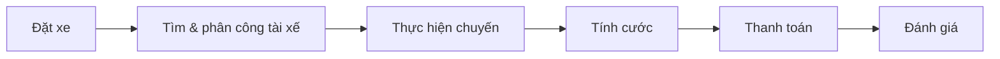
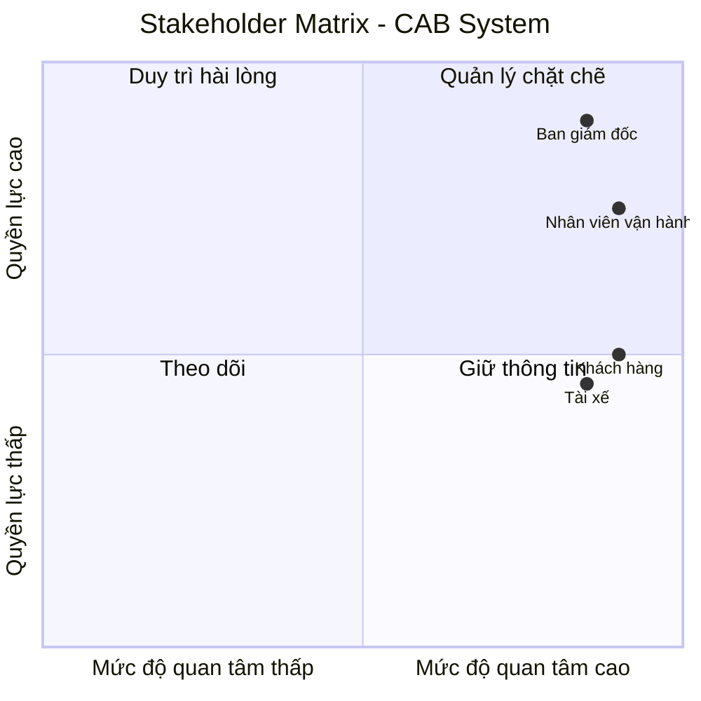
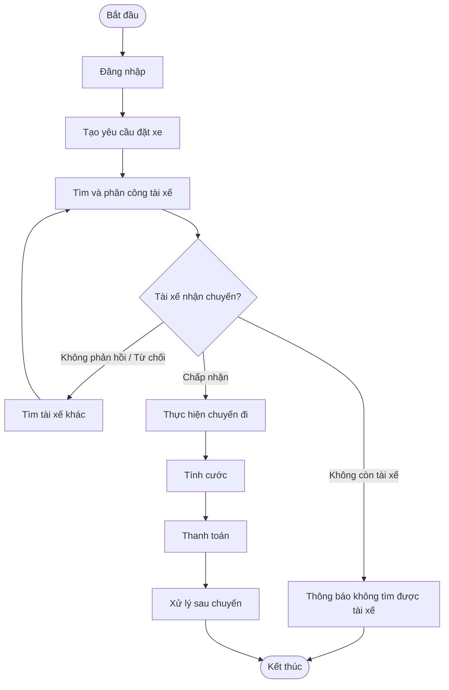
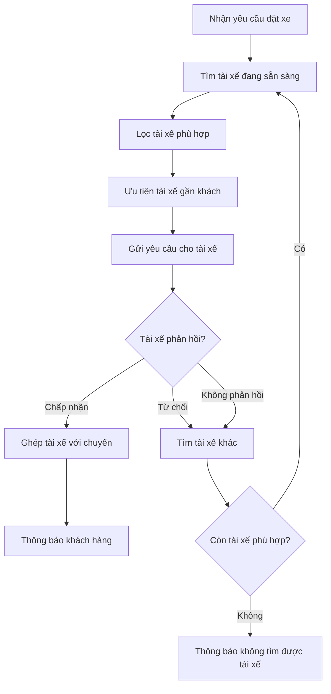
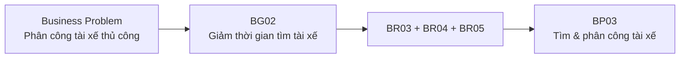
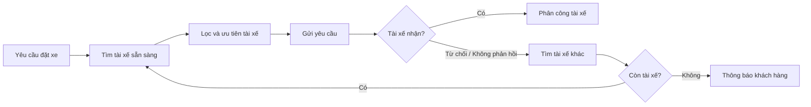
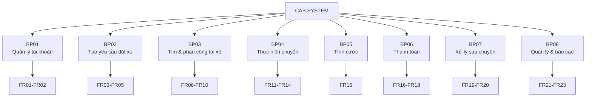
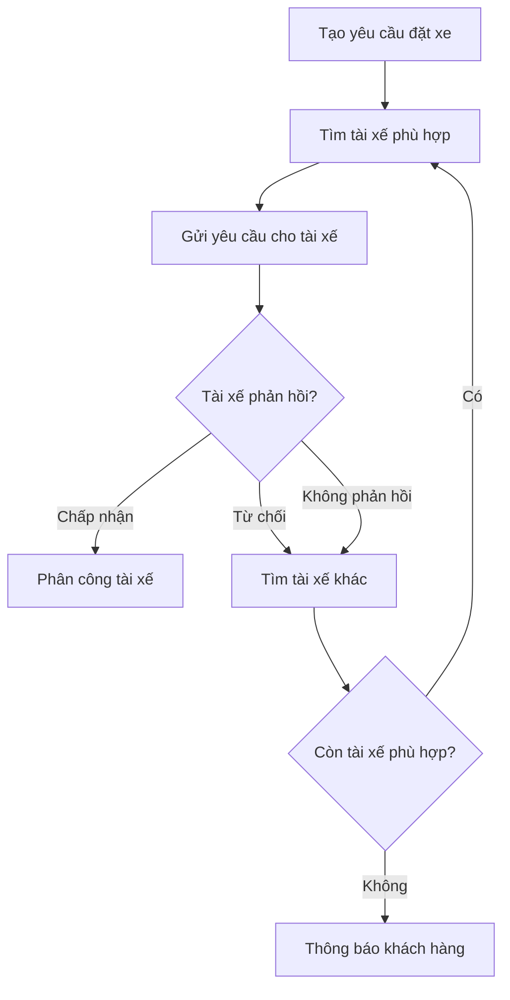
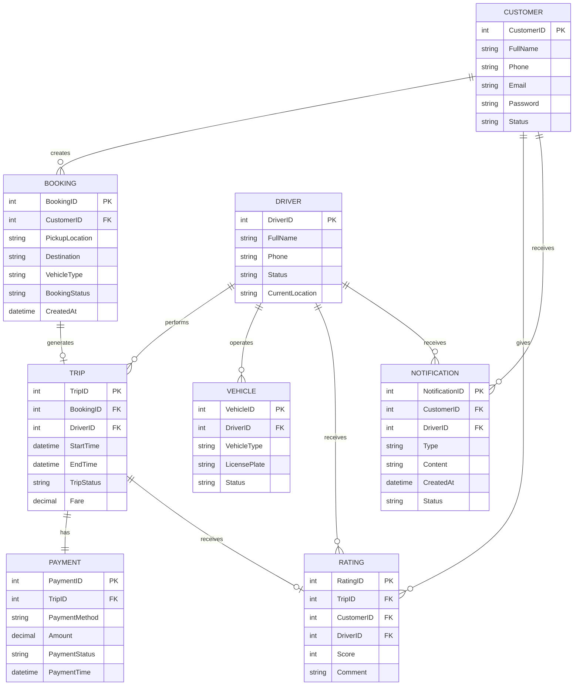
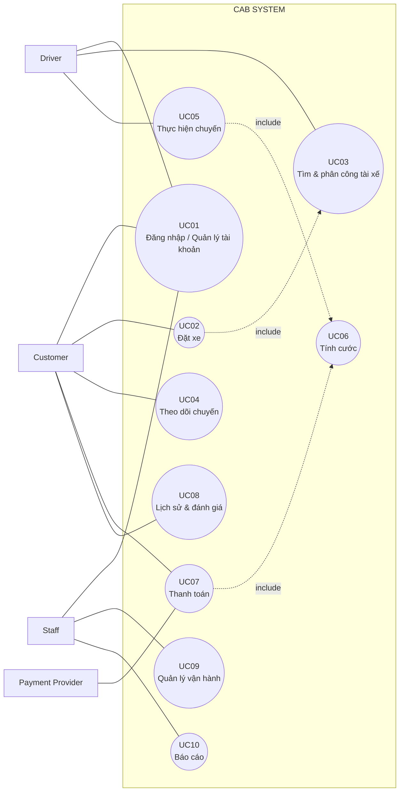

# BƯỚC 1: ĐỌC VÀ PHÂN TÍCH YÊU CẦU SƠ KHỞI

**Mục tiêu:** Hiểu bối cảnh nghiệp vụ, xác định vấn đề hiện tại và định hướng nhu cầu của khách hàng.

## 1. Bối cảnh nghiệp vụ

Công ty ABC cung cấp dịch vụ đặt xe trực tuyến. Hệ thống hiện tại còn phụ thuộc nhiều vào xử lý thủ công, đặc biệt trong việc tìm và phân công tài xế. Khách hàng khó theo dõi chuyến đi, thông tin thanh toán chưa được quản lý tập trung và hệ thống khó mở rộng khi số lượng người dùng tăng.

## 2. Business Problem

| Mã       | Business Problem                       | Ảnh hưởng                                        |
| -------- | -------------------------------------- | ------------------------------------------------ |
| **BP01** | Tìm và phân công tài xế còn thủ công   | Tốn thời gian, khó xử lý khi số chuyến tăng      |
| **BP02** | Khách hàng khó theo dõi chuyến đi      | Trải nghiệm khách hàng chưa tốt                  |
| **BP03** | Thanh toán chưa được quản lý tập trung | Khó quản lý giao dịch                            |
| **BP04** | Hệ thống khó mở rộng                   | Khó đáp ứng khi số lượng khách hàng, tài xế tăng |

### Business Problem chính

> **Việc tìm và phân công tài xế còn phụ thuộc nhiều vào xử lý thủ công, gây mất thời gian và khó đáp ứng khi số lượng chuyến tăng.**

## 3. Nhu cầu chính của khách hàng

CAB System cần:

* Tự động **tìm và phân công tài xế phù hợp**.
* Cho phép khách hàng **theo dõi trạng thái chuyến đi**.
* Quản lý tập trung **khách hàng, tài xế, phương tiện và chuyến đi**.
* Hỗ trợ **tính cước và thanh toán**.
* Tự động **thông báo** các sự kiện quan trọng.
* Hỗ trợ nhân viên vận hành **theo dõi và xử lý sự cố**.
* Cung cấp **báo cáo cơ bản**.
* Đảm bảo **bảo mật, phân quyền, ổn định và khả năng mở rộng**.

## 4. Stakeholder chính

| Stakeholder          | Vai trò chính                          |
| -------------------- | -------------------------------------- |
| **Customer**         | Đặt xe, theo dõi, thanh toán, đánh giá |
| **Driver**           | Nhận và thực hiện chuyến               |
| **Operation Staff**  | Quản lý và hỗ trợ vận hành             |
| **Payment Provider** | Xử lý thanh toán điện tử               |

## 5. Quy trình nghiệp vụ tổng quát



### Kết luận Bước 1

> **Công ty ABC cần xây dựng CAB System để tự động hóa quy trình đặt xe, đặc biệt là tìm và phân công tài xế, đồng thời cải thiện khả năng theo dõi chuyến, quản lý thanh toán và mở rộng hệ thống.**

**→ Bản này phù hợp hơn để làm bài**, vì không cần tách riêng “khách hàng muốn trả lời câu hỏi gì”, “giá trị so với hệ thống cũ” và “Business Problem cụ thể” thành nhiều phần khi các nội dung đó đã được thể hiện trong bảng Business Problem và nhu cầu chính.

Bước 2: Xác định StackHolder(lập bảng 2 cột, cột thứ nhất stackholder, cột thứ hai là vai trò của nó và lập 1 cái ma trận stackhoder matrix cho biết tầm quan trọng strackholder trong hệ thống bằng công cụ mermaid dùng để vẽ các sơ đồ match dow)
## 1. Danh sách Stakeholder

| **Stakeholder** | **Vai trò / Mối quan tâm đối với hệ thống** |
|---|---|
| **Ban giám đốc** | Đưa ra định hướng, mục tiêu và yêu cầu tổng thể của dự án; mong muốn hệ thống có khả năng mở rộng lâu dài; theo dõi báo cáo về số chuyến, doanh thu, tỷ lệ hoàn thành, tỷ lệ hủy và hiệu quả tài xế. |
| **Khách hàng** | Người trực tiếp sử dụng hệ thống để đăng ký/đăng nhập, nhập điểm đón – điểm đến, chọn loại xe, đặt xe, theo dõi chuyến đi, xem lịch sử, thanh toán và đánh giá tài xế. |
| **Tài xế** | Người cung cấp dịch vụ vận chuyển; quản lý hồ sơ và phương tiện, cập nhật trạng thái sẵn sàng, nhận/từ chối chuyến và cập nhật trạng thái trong quá trình thực hiện chuyến. |
| **Nhân viên vận hành** | Quản lý khách hàng, tài xế, phương tiện và chuyến đi; theo dõi các chuyến đang diễn ra, kiểm tra trạng thái tài xế, hỗ trợ xử lý chuyến gặp lỗi và tra cứu lịch sử giao dịch. |
| **Business Analyst (BA)** | Phân tích yêu cầu nghiệp vụ, xác định phạm vi, tác nhân, quy trình nghiệp vụ, yêu cầu chức năng/phi chức năng, quy tắc nghiệp vụ, ngoại lệ và làm rõ những yêu cầu chưa được khách hàng xác định. |
| **Nhà cung cấp dịch vụ thanh toán** | Cung cấp dịch vụ thanh toán điện tử được tích hợp với CAB System; xử lý giao dịch thanh toán mà không yêu cầu CAB lưu trực tiếp thông tin thẻ/tài khoản nhạy cảm. |
| **Nhà cung cấp dịch vụ thông báo** | Hỗ trợ gửi thông báo cho khách hàng và tài xế; cho phép hệ thống bổ sung thêm các kênh hoặc nhà cung cấp thông báo trong tương lai. |
| **Nhóm phát triển (Development Team)** | Xây dựng, kiểm thử, triển khai và bảo trì CAB System dựa trên các yêu cầu đã được BA làm rõ. |

## 2. Stakeholder Matrix


                 
Bước 3: xác định các busness gold;(bg 01: Giảm thời gian tìm tài xế tự động tìm tài xế, 02: hỗ trợ thanh toán)
| Mã       | Business Goal                                                | Diễn giải                                                                                                 |
| -------- | ------------------------------------------------------------ | --------------------------------------------------------------------------------------------------------- |
| **BG01** | **Giảm thời gian tìm và phân công tài xế**                   | Tự động tìm tài xế phù hợp, ưu tiên tài xế gần và tiếp tục tìm tài xế khác khi bị từ chối/không phản hồi. |
| **BG02** | **Hỗ trợ thanh toán**                                        | Hỗ trợ tiền mặt và thanh toán điện tử thông qua Payment Provider.                                         |
| **BG03** | **Nâng cao khả năng theo dõi chuyến đi**                     | Cho phép khách hàng biết trạng thái chuyến, tài xế và thời gian dự kiến đến.                              |
| **BG04** | **Tự động hóa và quản lý tập trung**                         | Quản lý xuyên suốt đặt xe, chuyến đi, khách hàng, tài xế, phương tiện và giao dịch.                       |
| **BG05** | **Nâng cao hiệu quả vận hành**                               | Hỗ trợ nhân viên theo dõi chuyến, xử lý sự cố và cung cấp báo cáo quản lý.                                |
| **BG06** | **Đảm bảo hệ thống ổn định, an toàn và có khả năng mở rộng** | Bảo mật dữ liệu, phân quyền, chịu tải và cho phép bổ sung chức năng trong tương lai.                      |

Bước 4: Xác định phạm vi yêu cầu(Scope) phải làm(vd:quản lý khách hàng, ql tài xế) và những cái nào không nên làm
Vì thời gian xây dựng CAB System chỉ **7 tuần**, cần tập trung vào các nghiệp vụ **cốt lõi** và loại bỏ những chức năng mở rộng chưa cần thiết.
### 1. Phạm vi PHẢI LÀM – In Scope

| **Phạm vi**              | **Yêu cầu cần làm**                                                 |
| ------------------------ | ------------------------------------------------------------------- |
| **Quản lý khách hàng**   | Đăng ký, đăng nhập, cập nhật thông tin, xem lịch sử chuyến          |
| **Quản lý tài xế**       | Hồ sơ, trạng thái sẵn sàng, nhận/từ chối chuyến                     |
| **Quản lý phương tiện**  | Quản lý thông tin xe và loại xe                                     |
| **Đặt xe**               | Nhập điểm đón, điểm đến, chọn loại xe, tạo yêu cầu                  |
| **Tìm tài xế**           | Tự động tìm tài xế phù hợp, gần khách hàng và đang sẵn sàng         |
| **Phân công tài xế**     | Tự tìm tài xế khác khi tài xế từ chối/không phản hồi                |
| **Quản lý chuyến đi**    | Cập nhật và theo dõi trạng thái chuyến                              |
| **Tính cước**            | Tính số tiền khách hàng phải trả                                    |
| **Thanh toán**           | Tiền mặt và **01 phương thức thanh toán online**                    |
| **Thông báo**            | Thông báo cơ bản cho khách hàng và tài xế                           |
| **Đánh giá**             | Khách hàng đánh giá tài xế sau chuyến                               |
| **Quản lý vận hành**     | Quản lý khách hàng, tài xế, phương tiện, chuyến đi, giao dịch       |
| **Báo cáo cơ bản**       | Số chuyến, doanh thu, tỷ lệ hoàn thành, tỷ lệ hủy                   |
| **Bảo mật & phân quyền** | Đăng nhập, phân quyền nhân viên, bảo vệ dữ liệu và lưu vết thao tác |

### 2. Phạm vi KHÔNG NÊN LÀM – Out of Scope

| **Không nên làm trong 7 tuần**      | **Lý do**                                          |
| ----------------------------------- | -------------------------------------------------- |
| Đăng nhập Google/Facebook           | Không phải chức năng cốt lõi                       |
| Loyalty/điểm thưởng                 | Chưa được yêu cầu trực tiếp                        |
| Hệ thống tuyển dụng tài xế          | Ngoài quy trình đặt xe                             |
| Quản lý bảo trì/sửa chữa xe         | Không thuộc nghiệp vụ cốt lõi                      |
| Đặt xe theo lịch                    | Có thể để giai đoạn sau                            |
| Đặt nhiều điểm dừng phức tạp        | Làm tăng phạm vi                                   |
| AI dự đoán nhu cầu                  | Chức năng nâng cao                                 |
| Thuật toán Matching nâng cao        | Giai đoạn đầu chỉ cần tìm tài xế phù hợp/gần khách |
| Dynamic/Surge Pricing               | Cách tính cước nâng cao, chưa được chốt            |
| Tích hợp nhiều cổng thanh toán      | Giai đoạn đầu chỉ cần 1 Payment Provider           |
| Xây dựng ví điện tử CAB             | Không cần thiết ở phiên bản đầu                    |
| SMS, Email, Zalo, Messenger...      | Giai đoạn đầu chỉ cần kênh thông báo cơ bản        |
| Dashboard BI nâng cao               | Chỉ cần báo cáo cơ bản                             |
| Hệ thống HRM                        | Không thuộc phạm vi đặt xe                         |
| Phân tích hành vi khách hàng/tài xế | Chưa phải chức năng cốt lõi                        |

### Chốt phạm vi

**PHẢI LÀM:**

> **Quản lý khách hàng → Quản lý tài xế → Quản lý phương tiện → Đặt xe → Tìm/phân công tài xế → Quản lý chuyến → Tính cước → Thanh toán → Thông báo → Đánh giá → Quản lý vận hành → Báo cáo cơ bản → Bảo mật.**

**KHÔNG NÊN LÀM:**

> **AI nâng cao, Loyalty, HRM, bảo trì xe, nhiều cổng thanh toán, ví điện tử riêng, nhiều kênh thông báo, BI nâng cao và các dịch vụ mở rộng.**

**Nguyên tắc:** Trong 7 tuần, **làm tốt quy trình đặt xe cốt lõi trước; các chức năng mở rộng để Future Scope.**

Bước 5:Thiết kế busness requiment(Lạp một bang mã  tên của bg diễn giải
Bảng Business Requirements của CAB System

Dưới đây là bảng **Business Requirement** được thiết kế lại đúng 3 cột: **Mã – Tên – Diễn giải**.

| Mã       | Tên Business Requirement     | Diễn giải                                                                  |
| -------- | ---------------------------- | -------------------------------------------------------------------------- |
| **BR01** | Quản lý tài khoản            | Cho phép người dùng đăng ký, đăng nhập và quản lý tài khoản.               |
| **BR02** | Tạo yêu cầu đặt xe           | Cho phép khách hàng nhập điểm đón, điểm đến, loại xe và gửi yêu cầu.       |
| **BR03** | Tự động tìm tài xế           | Hệ thống tự động tìm tài xế phù hợp và đang sẵn sàng.                      |
| **BR04** | Ưu tiên tài xế phù hợp       | Ưu tiên tài xế phù hợp và gần khách hàng.                                  |
| **BR05** | Tìm tài xế thay thế          | Khi tài xế từ chối/không phản hồi, hệ thống tiếp tục tìm tài xế khác.      |
| **BR06** | Theo dõi chuyến đi           | Khách hàng theo dõi trạng thái, tài xế và thời gian dự kiến đến.           |
| **BR07** | Quản lý tài xế & phương tiện | Quản lý hồ sơ, phương tiện, trạng thái và vị trí tài xế.                   |
| **BR08** | Thực hiện chuyến đi          | Tài xế cập nhật các trạng thái trong quá trình thực hiện chuyến.           |
| **BR09** | Tính cước                    | Xác định số tiền khách hàng phải trả sau khi chuyến hoàn thành.            |
| **BR10** | Thanh toán                   | Hỗ trợ tiền mặt và thanh toán điện tử.                                     |
| **BR11** | Thông báo                    | Thông báo các sự kiện quan trọng cho khách hàng và tài xế.                 |
| **BR12** | Lịch sử & đánh giá           | Lưu lịch sử chuyến và cho phép khách hàng đánh giá tài xế.                 |
| **BR13** | Quản lý vận hành             | Hỗ trợ nhân viên quản lý và xử lý các hoạt động của hệ thống.              |
| **BR14** | Báo cáo                      | Cung cấp số chuyến, doanh thu, tỷ lệ hoàn thành, hủy và hiệu quả tài xế.   |
| **BR15** | Bảo mật & mở rộng            | Đảm bảo xác thực, phân quyền, bảo vệ dữ liệu, ổn định và khả năng mở rộng. |

## BƯỚC 6. XÁC ĐỊNH BUSINESS PROCESS – QUY TRÌNH NGHIỆP VỤ

### 1. Business Process tổng thể

**Quy trình nghiệp vụ chính của CAB System:**

> **Quy trình đặt và thực hiện chuyến xe từ khi khách hàng tạo yêu cầu đến khi chuyến hoàn thành, thanh toán và đánh giá.**

| Mã       | Business Process           | Actor chính                  | Mục đích                       |
| -------- | -------------------------- | ---------------------------- | ------------------------------ |
| **BP01** | Quản lý tài khoản          | Khách hàng                   | Đăng nhập, quản lý tài khoản   |
| **BP02** | Tạo yêu cầu đặt xe         | Khách hàng                   | Tạo yêu cầu chuyến đi          |
| **BP03** | Tìm và phân công tài xế    | Hệ thống, Tài xế             | Tự động tìm và ghép tài xế     |
| **BP04** | Thực hiện chuyến đi        | Tài xế, Khách hàng           | Đón khách và hoàn thành chuyến |
| **BP05** | Tính cước                  | Hệ thống                     | Xác định số tiền phải trả      |
| **BP06** | Thanh toán                 | Khách hàng, Payment Provider | Hoàn tất thanh toán            |
| **BP07** | Xử lý sau chuyến           | Khách hàng                   | Xem lịch sử và đánh giá        |
| **BP08** | Quản lý vận hành & báo cáo | Nhân viên, Quản lý           | Theo dõi và quản lý hoạt động  |

> **Lưu ý:** Thông báo, phân quyền và audit là các chức năng hỗ trợ xuyên suốt, không nhất thiết phải tách thành Business Process riêng ở Bước 6.

---

### 2. Sơ đồ Business Process chính



### 3. BP03 – Tìm và phân công tài xế

Đây là **Business Process quan trọng nhất**, vì trực tiếp giải quyết vấn đề kinh doanh **phân công tài xế thủ công**.



### 4. Liên kết B1 → B6



### 5. Kết luận

> **CAB System gồm các quy trình chính từ quản lý tài khoản, tạo yêu cầu đặt xe, tìm và phân công tài xế, thực hiện chuyến, tính cước, thanh toán đến xử lý sau chuyến và quản lý vận hành. Trong đó, BP03 – Tìm và phân công tài xế là quy trình trọng tâm vì trực tiếp giải quyết vấn đề phân công tài xế thủ công. Khi tài xế từ chối hoặc không phản hồi, hệ thống phải tự động tìm tài xế khác mà không yêu cầu khách hàng tạo lại yêu cầu.**

**=> Với bài nộp, chỉ cần 5 phần trên là đủ.** Không cần đưa lại các đoạn giải thích dài, hai sơ đồ phụ “không phản hồi/từ chối”, hay tách riêng BP07 Thông báo và BP08 Phân quyền/Audit.

BƯỚC 7. THIẾT KẾ PHÂN RÃ YÊU CẦU NGHIỆP VỤ (FUNCTIONAL REQUIREMENTS)
Được. Dựa **đúng vào Bước 6 đã rút gọn** của bạn, Bước 7 nên phân rã từ **8 Business Process → Functional Requirements**, chỉ giữ những chức năng **cần thiết và quan trọng**, không thêm chức năng ngoài yêu cầu.

# BƯỚC 7: THIẾT KẾ PHÂN RÃ YÊU CẦU NGHIỆP VỤ

Đúng. Nếu **Bước 7 chỉ giữ những Functional Requirement quan trọng và cần thiết**, thì không cần 36 FR. Với thời gian **7 tuần**, nên rút xuống khoảng **20 FR cốt lõi**, tập trung vào quy trình đặt xe.

# BƯỚC 7: THIẾT KẾ PHÂN RÃ YÊU CẦU NGHIỆP VỤ

## 1. Phân rã Business Process → Functional Requirements

| Business Process                      | Functional Requirements |
| ------------------------------------- | ----------------------- |
| **BP01 – Quản lý tài khoản**          | FR01–FR02               |
| **BP02 – Tạo yêu cầu đặt xe**         | FR03–FR05               |
| **BP03 – Tìm và phân công tài xế**    | FR06–FR10               |
| **BP04 – Thực hiện chuyến đi**        | FR11–FR14               |
| **BP05 – Tính cước**                  | FR15                    |
| **BP06 – Thanh toán**                 | FR16–FR18               |
| **BP07 – Xử lý sau chuyến**           | FR19–FR20               |
| **BP08 – Quản lý vận hành & báo cáo** | FR21–FR23               |

→ **Tổng cộng: 23 Functional Requirements cốt lõi.**

---

## 2. Functional Requirements

### BP01 – Quản lý tài khoản

| Mã       | Functional Requirement                                                          |
| -------- | ------------------------------------------------------------------------------- |
| **FR01** | Hệ thống cho phép khách hàng và tài xế đăng nhập, xác thực tài khoản.           |
| **FR02** | Hệ thống cho phép người dùng cập nhật thông tin cá nhân và thông tin cần thiết. |

---

### BP02 – Tạo yêu cầu đặt xe

| Mã       | Functional Requirement                                  |
| -------- | ------------------------------------------------------- |
| **FR03** | Hệ thống cho phép khách hàng nhập điểm đón và điểm đến. |
| **FR04** | Hệ thống cho phép khách hàng lựa chọn loại xe.          |
| **FR05** | Hệ thống tiếp nhận và ghi nhận yêu cầu đặt xe.          |

---

### BP03 – Tìm và phân công tài xế ⭐

Đây là **phần quan trọng nhất** của Bước 7.

| Mã       | Functional Requirement                                                                       |
| -------- | -------------------------------------------------------------------------------------------- |
| **FR06** | Hệ thống tự động tìm các tài xế đang sẵn sàng nhận chuyến.                                   |
| **FR07** | Hệ thống lọc và ưu tiên tài xế phù hợp, gần khách hàng.                                      |
| **FR08** | Hệ thống gửi yêu cầu chuyến cho tài xế được lựa chọn và ghi nhận phản hồi.                   |
| **FR09** | Hệ thống xử lý trường hợp tài xế từ chối hoặc không phản hồi.                                |
| **FR10** | Hệ thống tự động tìm tài xế khác; nếu không còn tài xế phù hợp thì thông báo cho khách hàng. |

### Luồng quan trọng



---

### BP04 – Thực hiện chuyến đi

| Mã       | Functional Requirement                                                  |
| -------- | ----------------------------------------------------------------------- |
| **FR11** | Hệ thống ghép tài xế với chuyến đi sau khi tài xế chấp nhận.            |
| **FR12** | Tài xế cập nhật trạng thái: đến điểm đón, đã đón khách, đang di chuyển. |
| **FR13** | Tài xế cập nhật trạng thái hoàn thành chuyến.                           |
| **FR14** | Khách hàng theo dõi trạng thái chuyến và thông tin tài xế.              |

---

### BP05 – Tính cước

| Mã       | Functional Requirement                                                   |
| -------- | ------------------------------------------------------------------------ |
| **FR15** | Hệ thống xác định số tiền khách hàng phải trả sau khi chuyến hoàn thành. |

> Chưa đưa công thức tính cước vì **khách hàng chưa chốt công thức**.

---

### BP06 – Thanh toán

| Mã       | Functional Requirement                                                                        |
| -------- | --------------------------------------------------------------------------------------------- |
| **FR16** | Hệ thống hỗ trợ thanh toán tiền mặt và thanh toán điện tử.                                    |
| **FR17** | Hệ thống tích hợp Payment Provider để thực hiện thanh toán điện tử và nhận kết quả giao dịch. |
| **FR18** | Hệ thống thông báo và xử lý trường hợp thanh toán điện tử thất bại.                           |

---

### BP07 – Xử lý sau chuyến

| Mã       | Functional Requirement                                                  |
| -------- | ----------------------------------------------------------------------- |
| **FR19** | Hệ thống lưu và cho phép khách hàng xem lịch sử chuyến đi.              |
| **FR20** | Hệ thống cho phép khách hàng đánh giá tài xế sau khi chuyến hoàn thành. |

---

### BP08 – Quản lý vận hành & báo cáo

| Mã       | Functional Requirement                                                                                    |
| -------- | --------------------------------------------------------------------------------------------------------- |
| **FR21** | Nhân viên vận hành quản lý khách hàng, tài xế, phương tiện và chuyến đi.                                  |
| **FR22** | Nhân viên vận hành theo dõi chuyến đang diễn ra và xử lý các trường hợp gặp sự cố.                        |
| **FR23** | Hệ thống cung cấp báo cáo cơ bản về số chuyến, doanh thu, tỷ lệ hoàn thành, tỷ lệ hủy và hiệu quả tài xế. |

---

# 3. Sơ đồ phân rã tổng thể


BƯỚC 8: XÁC ĐỊNH BUSNESS RULE VÀ EXCEPTION

## 1. Business Rule

| Mã       | Business Rule                                                                             | Áp dụng   |
| -------- | ----------------------------------------------------------------------------------------- | --------- |
| **BR01** | Người dùng phải đăng nhập/xác thực trước khi sử dụng các chức năng yêu cầu tài khoản.     | BP01      |
| **BR02** | Yêu cầu đặt xe phải có **điểm đón, điểm đến và loại xe**.                                 | BP02      |
| **BR03** | Hệ thống chỉ tìm các tài xế đang **sẵn sàng nhận chuyến**.                                | BP03      |
| **BR04** | Hệ thống ưu tiên tài xế **phù hợp và gần khách hàng**.                                    | BP03      |
| **BR05** | Nếu tài xế **từ chối hoặc không phản hồi**, hệ thống phải tự động tìm tài xế khác.        | BP03      |
| **BR06** | Khách hàng **không phải tạo lại yêu cầu** khi hệ thống tìm tài xế khác.                   | BP03      |
| **BR07** | Nếu không còn tài xế phù hợp, hệ thống phải **thông báo cho khách hàng**.                 | BP03      |
| **BR08** | Chỉ tài xế đã được phân công mới được thực hiện và cập nhật trạng thái chuyến.            | BP04      |
| **BR09** | Chuyến phải hoàn thành trước khi hệ thống thực hiện tính cước và thanh toán.              | BP04–BP06 |
| **BR10** | Khách hàng được thanh toán bằng tiền mặt hoặc phương thức thanh toán điện tử được hỗ trợ. | BP06      |
| **BR11** | Thanh toán điện tử được thực hiện thông qua **Payment Provider**.                         | BP06      |
| **BR12** | Khách hàng chỉ được đánh giá tài xế sau khi chuyến hoàn thành.                            | BP07      |
| **BR13** | Chức năng quản lý và báo cáo chỉ được thực hiện bởi người dùng có quyền phù hợp.          | BP08      |

---

# 2. Exception

| Mã       | Exception                                         | Cách xử lý                                                      |
| -------- | ------------------------------------------------- | --------------------------------------------------------------- |
| **EX01** | Người dùng chưa đăng nhập.                        | Yêu cầu đăng nhập/xác thực.                                     |
| **EX02** | Yêu cầu đặt xe thiếu thông tin.                   | Không cho gửi yêu cầu, yêu cầu bổ sung thông tin.               |
| **EX03** | Không có tài xế đang sẵn sàng.                    | Thông báo khách hàng không tìm được tài xế.                     |
| **EX04** | Tài xế từ chối chuyến.                            | Tự động tìm tài xế khác.                                        |
| **EX05** | Tài xế không phản hồi.                            | Xử lý theo thời gian chờ và tìm tài xế khác.                    |
| **EX06** | Không còn tài xế phù hợp.                         | Thông báo khách hàng và kết thúc yêu cầu.                       |
| **EX07** | Thanh toán điện tử thất bại.                      | Thông báo khách hàng và xử lý lại theo chính sách doanh nghiệp. |
| **EX08** | Payment Provider không phản hồi/kết nối thất bại. | Ghi nhận trạng thái giao dịch và thông báo phù hợp.             |
| **EX09** | Nhân viên không có quyền thực hiện thao tác.      | Từ chối thao tác.                                               |
| **EX10** | Chuyến đi gặp sự cố.                              | Nhân viên vận hành kiểm tra và hỗ trợ xử lý.                    |

---

# 3. Business Rule quan trọng nhất

Phần này nên **nhấn mạnh khi làm bài/thuyết trình**, vì nó liên quan trực tiếp đến Business Problem chính.



### Quy tắc cốt lõi:

> **BR05:** Khi tài xế từ chối hoặc không phản hồi, hệ thống phải tự động tìm tài xế khác.

> **BR06:** Khách hàng không cần tạo lại yêu cầu đặt xe.

> **BR07:** Nếu không còn tài xế phù hợp, hệ thống phải thông báo cho khách hàng.

---

# 4. Những vấn đề cần làm rõ với khách hàng

Trong yêu cầu gốc, khách hàng **chưa chốt** các nội dung này. Vì vậy **không được tự đặt giá trị**.

| Nội dung chưa xác định                       |
| -------------------------------------------- |
| Thời gian tài xế phải phản hồi               |
| Tiêu chí cụ thể để xác định tài xế phù hợp   |
| Cách ưu tiên tài xế khi có nhiều tài xế      |
| Số lần hệ thống tìm tài xế khác              |
| Công thức tính cước                          |
| Chính sách hủy chuyến                        |
| Cách xử lý khi mất kết nối mạng              |
| Chính sách xử lý lại khi thanh toán thất bại |
| Thời gian lưu trữ dữ liệu                    |

---

## 5. Kết luận Bước 8

> **Bước 8 xác định các quy tắc mà hệ thống CAB phải tuân thủ và cách xử lý các trường hợp ngoại lệ. Quy tắc quan trọng nhất là khi tài xế từ chối hoặc không phản hồi, hệ thống phải tự động tìm tài xế khác mà không yêu cầu khách hàng tạo lại yêu cầu. Các nội dung chưa được khách hàng chốt như thời gian phản hồi, tiêu chí ưu tiên tài xế, công thức tính cước và chính sách hủy sẽ được BA tiếp tục làm rõ với stakeholder.**

### Chuỗi cuối cùng của Bước 6 → 8:

```text
BP03
Tìm & phân công tài xế
        ↓
FR06–FR10
Tự động tìm → ưu tiên → gửi → xử lý từ chối/không phản hồi
        ↓
BR05–BR07
Từ chối/không phản hồi → tìm tài xế khác
        ↓
EX04–EX06
Từ chối / Không phản hồi / Không còn tài xế
```

BƯỚC 9: BẮT ĐẦU BƯỚC DÂT MONELINK NHÌN DÔ ĐÓ ĐỂ XÁC ĐỊNH NHỮNG THỰC THỂ VÀ VẼ RA NHỮNG SƠ ĐỒ ERD
Đúng. **Bước 9** nên bắt đầu từ các yêu cầu đã chốt ở Bước 1–8 để xác định **thực thể (Entity)**, sau đó mới xây dựng **ERD**. Không nên nhảy ngay vào vẽ ERD.

## 9.1. Mục tiêu

Từ **Business Process + Functional Requirements + Business Rule**, xác định:

* Những **thực thể** cần quản lý.
* Thuộc tính chính của từng thực thể.
* Mối quan hệ giữa các thực thể.
* Khóa chính (**PK**) và khóa ngoại (**FK**).
* Làm cơ sở để thiết kế cơ sở dữ liệu cho CAB System.

---

# 9.2. Xác định thực thể từ Bước 7 và Bước 8

Không lấy tất cả danh từ trong yêu cầu để tạo Entity. Chỉ giữ những đối tượng **cần lưu trữ và quản lý lâu dài**.

| STT     | Thực thể                       | Lý do cần quản lý                      |
| ------- | ------------------------------ | -------------------------------------- |
| **E01** | **Khách hàng (Customer)**      | Lưu thông tin người đặt xe             |
| **E02** | **Tài xế (Driver)**            | Lưu thông tin và trạng thái tài xế     |
| **E03** | **Phương tiện (Vehicle)**      | Quản lý xe của tài xế                  |
| **E04** | **Yêu cầu đặt xe (Booking)**   | Lưu yêu cầu đặt xe của khách           |
| **E05** | **Chuyến đi (Trip)**           | Quản lý quá trình thực hiện chuyến     |
| **E06** | **Thanh toán (Payment)**       | Lưu thông tin và trạng thái thanh toán |
| **E07** | **Đánh giá (Rating)**          | Lưu đánh giá của khách hàng            |
| **E08** | **Nhân viên vận hành (Staff)** | Quản lý người vận hành hệ thống        |
| **E09** | **Thông báo (Notification)**   | Lưu các thông báo quan trọng           |

👉 **9 thực thể này là đủ cho ERD mức nghiệp vụ ban đầu.** Không nên thêm quá nhiều bảng khi đề bài chưa yêu cầu.

---

# 9.3. Xác định thuộc tính chính

### 1. CUSTOMER

| Thuộc tính          | Ý nghĩa              |
| ------------------- | -------------------- |
| **CustomerID (PK)** | Mã khách hàng        |
| FullName            | Họ tên               |
| Phone               | Số điện thoại        |
| Email               | Email                |
| Password            | Mật khẩu             |
| Status              | Trạng thái tài khoản |

### 2. DRIVER

| Thuộc tính        | Ý nghĩa              |
| ----------------- | -------------------- |
| **DriverID (PK)** | Mã tài xế            |
| FullName          | Họ tên               |
| Phone             | Số điện thoại        |
| Status            | Trạng thái hoạt động |
| CurrentLocation   | Vị trí hiện tại      |

### 3. VEHICLE

| Thuộc tính         | Ý nghĩa                |
| ------------------ | ---------------------- |
| **VehicleID (PK)** | Mã phương tiện         |
| DriverID (FK)      | Tài xế sở hữu/được gán |
| VehicleType        | Loại xe                |
| LicensePlate       | Biển số                |
| Status             | Trạng thái xe          |

### 4. BOOKING

| Thuộc tính         | Ý nghĩa            |
| ------------------ | ------------------ |
| **BookingID (PK)** | Mã yêu cầu         |
| CustomerID (FK)    | Khách hàng         |
| PickupLocation     | Điểm đón           |
| Destination        | Điểm đến           |
| VehicleType        | Loại xe            |
| BookingStatus      | Trạng thái yêu cầu |
| CreatedAt          | Thời gian tạo      |

### 5. TRIP

| Thuộc tính      | Ý nghĩa            |
| --------------- | ------------------ |
| **TripID (PK)** | Mã chuyến          |
| BookingID (FK)  | Yêu cầu đặt xe     |
| DriverID (FK)   | Tài xế             |
| StartTime       | Thời gian bắt đầu  |
| EndTime         | Thời gian kết thúc |
| TripStatus      | Trạng thái chuyến  |
| Fare            | Số tiền chuyến     |

### 6. PAYMENT

| Thuộc tính         | Ý nghĩa                |
| ------------------ | ---------------------- |
| **PaymentID (PK)** | Mã thanh toán          |
| TripID (FK)        | Chuyến đi              |
| PaymentMethod      | Phương thức thanh toán |
| Amount             | Số tiền                |
| PaymentStatus      | Trạng thái thanh toán  |
| PaymentTime        | Thời gian thanh toán   |

> Không lưu thông tin thẻ/tài khoản nhạy cảm trực tiếp trong CAB vì yêu cầu khách hàng quy định thanh toán điện tử thông qua Payment Provider.

### 7. RATING

| Thuộc tính        | Ý nghĩa              |
| ----------------- | -------------------- |
| **RatingID (PK)** | Mã đánh giá          |
| TripID (FK)       | Chuyến đi            |
| CustomerID (FK)   | Người đánh giá       |
| DriverID (FK)     | Tài xế được đánh giá |
| Score             | Điểm đánh giá        |
| Comment           | Nhận xét             |

### 8. STAFF

| Thuộc tính       | Ý nghĩa       |
| ---------------- | ------------- |
| **StaffID (PK)** | Mã nhân viên  |
| FullName         | Họ tên        |
| Phone            | Số điện thoại |
| Role             | Quyền hạn     |
| Status           | Trạng thái    |

### 9. NOTIFICATION

| Thuộc tính              | Ý nghĩa         |
| ----------------------- | --------------- |
| **NotificationID (PK)** | Mã thông báo    |
| CustomerID (FK)         | Khách hàng nhận |
| DriverID (FK)           | Tài xế nhận     |
| Type                    | Loại thông báo  |
| Content                 | Nội dung        |
| CreatedAt               | Thời gian       |
| Status                  | Trạng thái      |

---

# 9.4. Xác định mối quan hệ

Các quan hệ quan trọng:

```text
CUSTOMER 1 ───── N BOOKING

BOOKING 1 ───── 0..1 TRIP

DRIVER 1 ───── N TRIP

DRIVER 1 ───── N VEHICLE

TRIP 1 ───── 1 PAYMENT

TRIP 1 ───── 0..1 RATING

CUSTOMER 1 ───── N RATING

DRIVER 1 ───── N RATING

CUSTOMER 1 ───── N NOTIFICATION

DRIVER 1 ───── N NOTIFICATION

STAFF ───── quản lý ───── CUSTOMER / DRIVER / VEHICLE / TRIP
```

---

# 9.5. ERD mức khái niệm

Đây là sơ đồ nên vẽ đầu tiên:



## 9.6. Luồng xác định Entity

Nên trình bày Bước 9 theo logic:

```text
BƯỚC 7
Functional Requirements
        ↓
Xác định các đối tượng hệ thống cần lưu trữ
        ↓
BƯỚC 9
Entities
        ↓
Xác định thuộc tính
        ↓
Xác định PK / FK
        ↓
Xác định Cardinality
        ↓
ERD
        ↓
Thiết kế Database
```

### Đặc biệt cần chú ý

**Booking và Trip không nên gộp làm một**:

* **Booking** = yêu cầu khách hàng gửi lên.
* **Trip** = chuyến thực tế sau khi tìm và phân công được tài xế.

Điều này bám rất sát yêu cầu:

> Khách tạo yêu cầu → hệ thống tìm tài xế → tài xế nhận → thực hiện chuyến.

Đây cũng là lý do **Booking → Trip** là một quan hệ quan trọng trong ERD.

BƯỚC 10 – XÁC ĐỊNH NON-FUNCTIONAL REQUIREMENTS

Chỉ giữ các **NFR quan trọng và cần thiết** theo yêu cầu CAB:

| Mã        | Non-Functional Requirement     | Yêu cầu                                                                                                        |
| --------- | ------------------------------ | -------------------------------------------------------------------------------------------------------------- |
| **NFR01** | **Hiệu năng & ổn định**        | Hệ thống hoạt động ổn định khi số lượng khách hàng/chuyến tăng, đặc biệt vào giờ cao điểm.                     |
| **NFR02** | **Khả năng mở rộng**           | Có thể mở rộng khi số lượng khách hàng, tài xế và chuyến tăng.                                                 |
| **NFR03** | **Bảo mật**                    | Bảo vệ thông tin cá nhân, phương tiện, vị trí và giao dịch.                                                    |
| **NFR04** | **Xác thực & phân quyền**      | Kiểm soát đăng nhập và quyền truy cập các chức năng quản trị.                                                  |
| **NFR05** | **Độ tin cậy**                 | Lỗi thanh toán hoặc thông báo không được làm dừng toàn bộ quá trình đặt xe.                                    |
| **NFR06** | **Khả năng mở rộng chức năng** | Có thể bổ sung phương thức thanh toán, kênh thông báo và dịch vụ mới mà không phải xây dựng lại toàn hệ thống. |
| **NFR07** | **Audit**                      | Ghi nhận các thao tác quan trọng để phục vụ kiểm tra và truy vết.                                              |

### Phân nhóm ngắn gọn

```text
NFR
├── Hiệu năng & ổn định
├── Khả năng mở rộng
├── Bảo mật
├── Xác thực & phân quyền
├── Độ tin cậy
├── Mở rộng chức năng
└── Audit
```

> **Kết luận:** CAB System phải **ổn định – bảo mật – mở rộng được – đáng tin cậy**, đồng thời cho phép bổ sung chức năng mới mà ít ảnh hưởng đến hệ thống hiện tại.

BƯỚC 11: XÁC ĐỊNH, THIẾT KẾ USECASE , VẼ USECASE
# BƯỚC 11 – XÁC ĐỊNH, THIẾT KẾ VÀ VẼ USE CASE

Dựa vào **Bước 7 – Functional Requirements** và các stakeholder đã xác định, chỉ giữ các Use Case chính.

## 11.1. Xác định Actor

| Actor                | Vai trò                  |
| -------------------- | ------------------------ |
| **Customer**         | Đặt và theo dõi chuyến   |
| **Driver**           | Nhận và thực hiện chuyến |
| **Staff**            | Quản lý, hỗ trợ vận hành |
| **Payment Provider** | Xử lý thanh toán điện tử |

---

## 11.2. Xác định Use Case

| Mã       | Use Case                      | Actor                      |
| -------- | ----------------------------- | -------------------------- |
| **UC01** | Đăng nhập / Quản lý tài khoản | Customer, Driver, Staff    |
| **UC02** | Đặt xe                        | Customer                   |
| **UC03** | Tìm & phân công tài xế        | System, Driver             |
| **UC04** | Theo dõi chuyến đi            | Customer                   |
| **UC05** | Thực hiện chuyến đi           | Driver                     |
| **UC06** | Tính cước                     | System                     |
| **UC07** | Thanh toán                    | Customer, Payment Provider |
| **UC08** | Xem lịch sử & đánh giá        | Customer                   |
| **UC09** | Quản lý vận hành              | Staff                      |
| **UC10** | Xem báo cáo                   | Staff                      |

---

# 11.3. Quan hệ Use Case quan trọng

* **Đặt xe** → `include` **Tìm & phân công tài xế**
* **Thực hiện chuyến** → `include` **Cập nhật trạng thái chuyến**
* **Thanh toán** → `include` **Tính cước**
* **Thanh toán** → `include` **Xử lý thanh toán điện tử**
* **Xem lịch sử & đánh giá** → `include` **Đánh giá tài xế**

Phần quan trọng nhất:

```text
Đặt xe
   ↓
Tìm & phân công tài xế
   ↓
Tài xế chấp nhận
   ↓
Thực hiện chuyến
   ↓
Tính cước
   ↓
Thanh toán
   ↓
Lịch sử & đánh giá
```

---

# 11.4. Use Case Diagram



### ⭐ Use Case quan trọng nhất

**UC03 – Tìm & phân công tài xế**

```text
Đặt xe
   ↓
Tìm tài xế phù hợp
   ↓
Gửi yêu cầu
   ↓
┌─────────────────────┐
│ Tài xế chấp nhận?   │
└─────────────────────┘
    ↓ Có       ↓ Không
Phân công     Tìm tài xế khác
                 ↓
            Không cần đặt lại
```

> **Bước 11:** Xác định **Actor → Use Case → Quan hệ giữa Use Case → Vẽ Use Case Diagram**. Chỉ giữ các Use Case chính, tránh tách quá nhỏ thành nhiều Use CasBUOWBUOW=

 
BƯỚC 13: XÁC ĐỊNH TIÊU CHÍ CHẤP NHẬN (ACCEPTANCE CRITERIA)(NHỮNG TIÊU CHÍ CHẤP NHẬN AC ĐỂ CHO BIẾT CÁC CHỨC NĂNG NÓ ĐƯỢC KẾT THÚC)


> **Acceptance Criteria (AC)** là điều kiện để xác định một chức năng **đã hoàn thành và có thể nghiệm thu**.

| Mã       | Chức năng              | Tiêu chí chấp nhận                                                                 |
| -------- | ---------------------- | ---------------------------------------------------------------------------------- |
| **AC01** | Đăng nhập              | Đúng thông tin → đăng nhập thành công; sai → báo lỗi.                              |
| **AC02** | Đặt xe                 | Nhập đủ điểm đón, điểm đến, loại xe → tạo yêu cầu thành công.                      |
| **AC03** | Tìm & phân công tài xế | Tìm được tài xế phù hợp → gửi yêu cầu; tài xế chấp nhận → phân công thành công.    |
| **AC04** | Tìm tài xế thay thế    | Tài xế từ chối/không phản hồi → tự động tìm tài xế khác, khách không phải đặt lại. |
| **AC05** | Không có tài xế        | Không còn tài xế phù hợp → thông báo khách hàng.                                   |
| **AC06** | Theo dõi chuyến        | Khách hàng xem được tài xế và trạng thái chuyến.                                   |
| **AC07** | Hoàn thành chuyến      | Tài xế cập nhật trạng thái → chuyến được ghi nhận hoàn thành.                      |
| **AC08** | Tính cước & thanh toán | Chuyến hoàn thành → hiển thị số tiền → ghi nhận kết quả thanh toán.                |
| **AC09** | Lịch sử & đánh giá     | Chuyến hoàn thành → khách xem lịch sử và đánh giá tài xế.                          |
| **AC10** | Vận hành & báo cáo     | Nhân viên có quyền → quản lý dữ liệu, theo dõi chuyến và xem báo cáo.              |

### Điểm quan trọng nhất

**AC03–AC05** là nhóm AC quan trọng nhất vì trực tiếp giải quyết **Business Problem chính**:

> **Tài xế từ chối/không phản hồi → hệ thống tự động tìm tài xế khác → không yêu cầu khách đặt lại → nếu không còn tài xế thì thông báo khách.**

### Chuỗi logic toàn bộ bài

```text
Bước 7: FR
   ↓
Hệ thống phải làm gì?
   ↓
Bước 11: Use Case
   ↓
Chức năng nào?
   ↓
Bước 12: AC
   ↓
Làm đến mức nào thì được xem là HOÀN THÀNH?
```
BƯỚC 14: TRUY XUẤT NGUỒN GỐC YÊU CẦU(TẠO BẢNG MA TRẬN TRUY XUẤT YÊU CẦU RTM CÓ CỘT THỨ NHẤT BP,BR,FR,UC,AC,TC
Đúng. Nếu đề bài yêu cầu **cột thứ nhất là BP, BR, FR, UC, AC, TC** thì nên làm RTM theo đúng chuỗi:

**BP → BR → FR → UC → AC → TC**

Dựa trên các bước CAB System đã xây dựng, đây là bản **gọn nhưng đầy đủ các yêu cầu quan trọng**:

# BƯỚC 14 – MA TRẬN TRUY XUẤT YÊU CẦU (RTM)

| BP                                    | BR                                                       | FR                                         | UC                              | AC                                                                       | TC                                       |
| ------------------------------------- | -------------------------------------------------------- | ------------------------------------------ | ------------------------------- | ------------------------------------------------------------------------ | ---------------------------------------- |
| **BP01** Phân công tài xế thủ công    | **BR03** Chỉ tìm tài xế sẵn sàng                         | **FR06** Tự động tìm tài xế                | **UC03** Tìm & phân công tài xế | **AC03** Tìm được tài xế → gửi yêu cầu và phân công khi tài xế chấp nhận | **TC01** Kiểm tra tìm & phân công tài xế |
| BP01                                  | **BR04** Ưu tiên tài xế phù hợp, gần khách               | **FR07** Lọc và ưu tiên tài xế             | UC03                            | AC03                                                                     | **TC02** Kiểm tra ưu tiên tài xế         |
| BP01                                  | **BR05** Tài xế từ chối/không phản hồi → tìm tài xế khác | **FR09** Xử lý từ chối/không phản hồi      | UC03                            | **AC04** Tự động tìm tài xế khác                                         | **TC03** Kiểm tra từ chối/không phản hồi |
| BP01                                  | **BR07** Không còn tài xế → thông báo khách              | **FR10** Tìm tài xế khác và thông báo      | UC03                            | **AC05** Thông báo khách hàng                                            | **TC04** Kiểm tra không có tài xế        |
| **BP02** Khách khó theo dõi chuyến    | **BR08** Tài xế được phân công mới cập nhật trạng thái   | **FR12** Cập nhật trạng thái chuyến        | **UC05** Thực hiện chuyến       | **AC07** Chuyến được ghi nhận hoàn thành                                 | **TC05** Kiểm tra cập nhật trạng thái    |
| BP02                                  | —                                                        | **FR14** Theo dõi trạng thái chuyến        | **UC04** Theo dõi chuyến        | **AC06** Khách xem được tài xế và trạng thái                             | **TC06** Kiểm tra theo dõi chuyến        |
| **BP03** Thanh toán chưa tập trung    | **BR09** Chuyến hoàn thành mới tính cước/thanh toán      | **FR15** Tính cước                         | **UC06** Tính cước              | **AC08** Hiển thị số tiền cần thanh toán                                 | **TC07** Kiểm tra tính cước              |
| BP03                                  | **BR10** Hỗ trợ tiền mặt và điện tử                      | **FR16** Thanh toán                        | **UC07** Thanh toán             | **AC08** Ghi nhận kết quả thanh toán                                     | **TC08** Kiểm tra thanh toán             |
| BP03                                  | **BR11** Thanh toán điện tử qua Payment Provider         | **FR17** Tích hợp Payment Provider         | UC07                            | AC08                                                                     | **TC09** Kiểm tra thanh toán điện tử     |
| BP03                                  | **BR10** Xử lý thanh toán thất bại                       | **FR18** Xử lý thanh toán điện tử thất bại | UC07                            | **AC10** Thông báo và xử lý thanh toán lỗi                               | **TC10** Kiểm tra thanh toán thất bại    |
| **BP04** Hệ thống khó mở rộng/quản lý | **BR13** Chỉ người có quyền được quản lý                 | **FR21** Quản lý KH, tài xế, xe, chuyến    | **UC09** Quản lý vận hành       | **AC10** Nhân viên có quyền quản lý dữ liệu                              | **TC11** Kiểm tra phân quyền quản lý     |
| BP04                                  | **BR13** Quản lý và xử lý sự cố                          | **FR22** Theo dõi chuyến và xử lý sự cố    | UC09                            | AC10                                                                     | **TC12** Kiểm tra xử lý sự cố            |
| BP04                                  | —                                                        | **FR23** Báo cáo hoạt động                 | **UC10** Xem báo cáo            | **AC10** Xem được báo cáo                                                | **TC13** Kiểm tra báo cáo                |

### Ý nghĩa

| Cột    | Ý nghĩa                                               |
| ------ | ----------------------------------------------------- |
| **BP** | Business Problem – Vấn đề nghiệp vụ                   |
| **BR** | Business Requirement/Rule – Yêu cầu/Quy tắc nghiệp vụ |
| **FR** | Functional Requirement – Yêu cầu chức năng            |
| **UC** | Use Case – Ca sử dụng                                 |
| **AC** | Acceptance Criteria – Tiêu chí chấp nhận              |
| **TC** | Test Case – Ca kiểm thử                               |

### Chuỗi truy xuất

```text
BP → BR → FR → UC → AC → TC
```

Ví dụ:

> **BP01:** Phân công tài xế thủ công
> ↓ **BR05:** Tài xế từ chối/không phản hồi → tìm tài xế khác
> ↓ **FR09:** Xử lý từ chối/không phản hồi
> ↓ **UC03:** Tìm & phân công tài xế
> ↓ **AC04:** Tự động tìm tài xế khác
> ↓ **TC03:** Kiểm tra trường hợp tài xế từ chối/không phản hồi

**Lưu ý:** Ở đây **BR được hiểu là Business Rule** theo Bước 8 của bài bạn đã xây dựng. Nếu giảng viên dùng **BR = Business Requirement**, cần đổi cách đặt mã/ý nghĩa cột cho thống nhất.

